# AgenticExplorer — arc42 Architektur-Dokumentation

**Version**: 2.1 (Product-Owner-Feedback integriert, Testing-Strategie, Workflow)
**Stand**: 2026-04-04
**App-Version**: v1.4.0
**Methode**: Retroaktive Spezifikation + Zukunfts-Vision (3-Runden Spezialisten-Review)

---

## 1. Einführung und Ziele

### 1.1 Aufgabenstellung — Vom IDE-Copiloten zum AgenticExplorer

**Der Paradigmenwechsel:**

Die Arbeit mit KI hat sich fundamental verändert. Früher war der IDE-Copilot ein reaktives Werkzeug — kein Kontext außer der aktuellen Datei, One-Shot-Prompts, einzelne Antworten. Heute arbeiten Entwickler mit **autonomen Agenten**, die über Stunden eigenständig operieren: Fehler suchen, Tests schreiben, Sub-Agenten spawnen, komplexe Workflows ausführen.

**Das Problem:** Wer überwacht diese Agenten?

- 3-5 Terminal-Fenster parallel, unkontrollierbar
- Keine Sicht auf Agent-Hierarchien (Parent/Child, Dependencies)
- Logs unstrukturiert, Fehler versteckt nach 10.000 Zeilen Output
- Keine Visualisierung, was gerade parallel läuft
- Skills/Hooks in `.claude/` versteckt — jedes Mal manuell öffnen

**Die Vision:**

> AgenticExplorer ist der **Kontrollraum für agentic Development**. Nicht nur Sessions verwalten, sondern echte Pipeline-Transparenz: Alle laufenden Agenten sehen (Hierarchie, Status, Token-Verbrauch), alle Workflows visualisieren, Code-Komplexität rasch erfassbar machen. Die Evolution von der IDE mit AI-Assistent hin zum vollständigen Orchestrierungs- und Monitoring-Tool für CLI-basierte LLM-Agenten.

**Roadmap-Vision:**

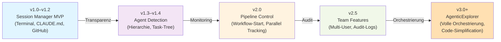
```mermaid
graph LR
    A["v1.0–v1.2<br/>Session Manager MVP<br/>(Terminal, CLAUDE.md, GitHub)"] -->|Transparenz| B["v1.3–v1.4<br/>Agent Detection<br/>(Hierarchie, Task-Tree)"]
    B -->|Monitoring| C["v2.0<br/>Pipeline Control<br/>(Workflow-Start, Parallel Tracking)"]
    C -->|Audit| D["v2.5<br/>Team Features<br/>(Multi-User, Audit-Logs)"]
    D -->|Orchestrierung| E["v3.0+<br/>AgenticExplorer<br/>(Volle Orchestrierung,<br/>Code-Simplification)"]

    style A fill:#e1f5ff
    style B fill:#f3e5f5
    style C fill:#fff3e0
    style D fill:#f1f8e9
    style E fill:#ffe0b2
```

### 1.2 Qualitätsziele

| Priorität | Qualitätsziel | Beschreibung | Messmetrik |
|-----------|---------------|--------------|------------|
| 1 | **Echtzeit-Agent-Transparenz** | Alle laufenden Agenten sichtbar, Hierarchie-Erkennung, Status in Echtzeit | < 100ms Latenz; 95% Detektionsrate |
| 2 | **Zuverlässigkeit** | Sessions/Settings überleben Crashes; keine Agenten-Daten verloren | 100% Data Recovery nach Crash |
| 3 | **Workflow-Klarheit** | Aus Skills/Hooks ableitbare Workflows sichtbar; Soll/Ist-Divergenzen erkennbar | Audit-View zeigt Abweichungen |
| 4 | **Security & Audit** | Alle Agent-Aktionen loggbar/reviewbar; Shell-Injection unmöglich | Pre-Commit Security Checks; Audit-Trail |
| 5 | **Code-Simplification** | Projekt-Kontext sofort einsehbar ohne manuelle Datei-Navigation | < 500ms bis Konfiguration sichtbar |

### 1.3 Stakeholder

| Stakeholder | Rolle | Erwartung | Neu in Vision |
|-------------|-------|-----------|---------------|
| **Henrik (Persona H)** | DevOps / AI Pipeline Engineer | Multi-Session, Agenten-Status, Determinismus, Workflow-Kontrolle | Hierarchie-Ansicht aller Agenten; Auto-Workflow-Start |
| **Clara (Persona C)** | Digitale Projektmanagerin | Chat-Steuerung, zentraler Hub, Dashboard-Übersicht | Parallel-Agent-Dashboard (Kanban-ähnlich) |
| **Team-Lead (NEU)** | Agile/DevOps Lead | Wissen wer läuft, was parallel passiert, Bottlenecks erkennen | Cross-Session Agent-Überwachung; Activity-Timeline |
| **Security-Reviewer (NEU)** | Security/Compliance | Agent-Aktionen auditieren, Compliance-Verstöße erkennen | Audit-Trail; Agent-Action-Log; Approval-Workflow |
| **Entwicklungs-Team** | Maintainer | Wartbarkeit, klare Architektur, automatisierte QA | Klare Separation: Agent-Detection vs. UI |

---

## 2. Randbedingungen (Constraints)

### 2.1 Technische Constraints

| Constraint | Beschreibung |
|------------|--------------|
| Tauri v2 | Desktop-Framework; API v2.0.0; Rust-Backend verpflichtend |
| Rust 2021 Edition | Backend-Sprache; `portable-pty 0.8` für PTY-Verwaltung |
| React 18.3 | Functional Components + Hooks; Strict Mode aktiv |
| TypeScript 5.5 | `--strict`, `--noUnusedLocals/Parameters`; ES2020 Target |
| Windows-Fokus | Primäre Plattform; PowerShell, cmd, Git Bash als Shells |
| Max. 8 Sessions | RAM-Budget und UI-Stabilität |
| IPC via JSON | Tauri Commands (async, JSON-serialisiert) + Event-Listener |

### 2.2 Organisatorische Constraints

| Constraint | Beschreibung |
|------------|--------------|
| Sprache | UI und Doku auf Deutsch; Code auf Englisch |
| Commits | Conventional Commits (`feat`, `fix`, `chore` mit Scopes) |
| Testing | Coverage-Schwellen CI-erzwungen (Details in Kapitel 10.3) |
| Pre-Commit | `tsc --noEmit` + `eslint` (TS), `cargo fmt --check` + `cargo check` (Rust) |
| Versionierung | Semver; Auto-Updater via GitHub Releases |

---

## 3. Kontextabgrenzung

### 3.1 Fachlicher Kontext

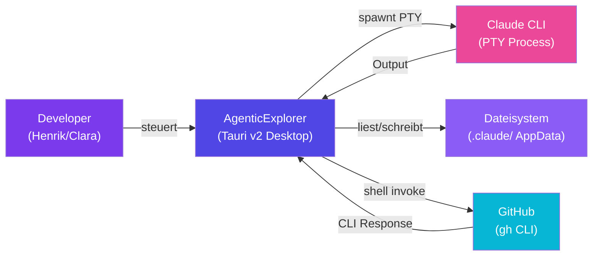
```mermaid
graph LR
    Developer["Developer<br/>(Henrik/Clara)"]
    App["AgenticExplorer<br/>(Tauri v2 Desktop)"]
    Claude["Claude CLI<br/>(PTY Process)"]
    GitHub["GitHub<br/>(gh CLI)"]
    FileSystem["Dateisystem<br/>(.claude/ AppData)"]

    Developer -->|steuert| App
    App -->|spawnt PTY| Claude
    Claude -->|Output| App
    App -->|liest/schreibt| FileSystem
    App -->|shell invoke| GitHub
    GitHub -->|CLI Response| App

    style App fill:#4f46e5,color:#fff
    style Developer fill:#7c3aed,color:#fff
    style Claude fill:#ec4899,color:#fff
    style GitHub fill:#06b6d4,color:#fff
    style FileSystem fill:#8b5cf6,color:#fff
```

| Nachbarsystem | Schnittstelle | Beschreibung |
|---------------|---------------|--------------|
| **Claude CLI** | PTY (STDIO) | Via `portable-pty` gespawnt; Output wird für Agent-Erkennung geparst |
| **GitHub** | `gh` CLI (Shell) | PRs, Issues, Branch-Info, Kanban (GitHub Projects API) |
| **Dateisystem** | Lokale I/O | `.claude/` (Skills, Hooks), AppData (Settings-Persistenz), Projekt-Dateien |
| **GitHub Releases** | HTTPS | Auto-Updater prüft `latest.json` auf neue Versionen |

### 3.2 Technischer Kontext

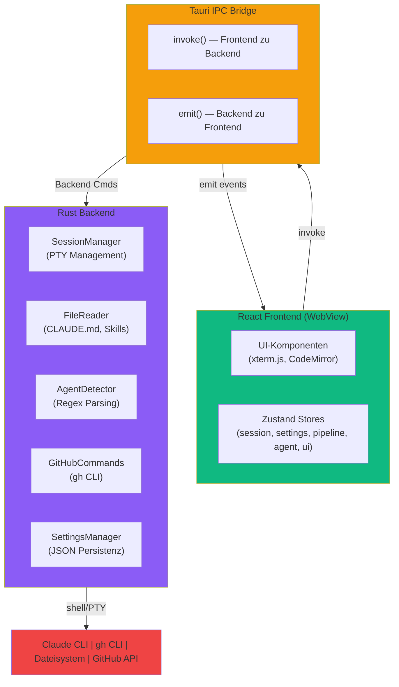
```mermaid
graph TB
    subgraph Frontend["React Frontend (WebView)"]
        UI["UI-Komponenten<br/>(xterm.js, CodeMirror)"]
        Stores["Zustand Stores<br/>(session, settings, pipeline, agent, ui)"]
    end

    subgraph Bridge["Tauri IPC Bridge"]
        Invoke["invoke() — Frontend zu Backend"]
        Emit["emit() — Backend zu Frontend"]
    end

    subgraph Backend["Rust Backend"]
        SessionMgr["SessionManager<br/>(PTY Management)"]
        FileReader["FileReader<br/>(CLAUDE.md, Skills)"]
        AgentDetector["AgentDetector<br/>(Regex Parsing)"]
        GitHubCmd["GitHubCommands<br/>(gh CLI)"]
        Settings["SettingsManager<br/>(JSON Persistenz)"]
    end

    External["Claude CLI | gh CLI | Dateisystem | GitHub API"]

    Frontend -->|invoke| Bridge
    Bridge -->|emit events| Frontend
    Bridge -->|Backend Cmds| Backend
    Backend -->|shell/PTY| External

    style Frontend fill:#10b981
    style Bridge fill:#f59e0b
    style Backend fill:#8b5cf6
    style External fill:#ef4444
```

**Protokolle und Formate:**
- Frontend zu Backend: `invoke("command_name", { params })` — JSON-serialisiert
- Backend zu Frontend: `app.emit("event_name", data)` — Tauri Event System
- Persistenz: JSON-Dateien in AppData
- Agent-Erkennung: Regex auf PTY-Output (Unicode-Zeichen: Bullet, Square, etc.)

### 3.3 Kontextdiagramm (C4 Level 0)

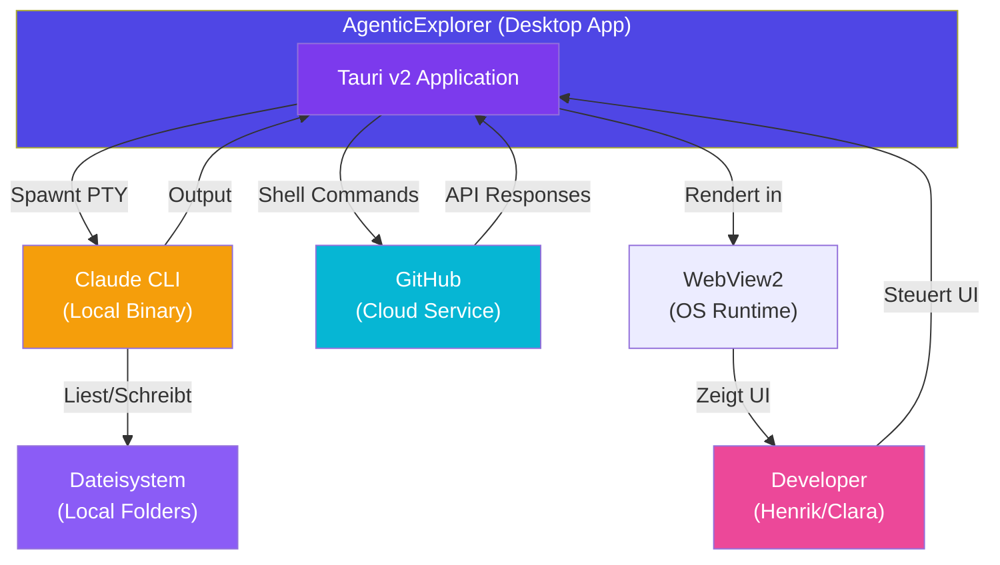
```mermaid
graph TB
    subgraph System["AgenticExplorer (Desktop App)"]
        App["Tauri v2 Application"]
    end

    Developer["Developer<br/>(Henrik/Clara)"]
    Claude["Claude CLI<br/>(Local Binary)"]
    GitHub["GitHub<br/>(Cloud Service)"]
    FileSystem["Dateisystem<br/>(Local Folders)"]
    WebView["WebView2<br/>(OS Runtime)"]

    Developer -->|Steuert UI| App
    App -->|Spawnt PTY| Claude
    Claude -->|Liest/Schreibt| FileSystem
    Claude -->|Output| App
    App -->|Shell Commands| GitHub
    GitHub -->|API Responses| App
    App -->|Rendert in| WebView
    WebView -->|Zeigt UI| Developer

    style System fill:#4f46e5,color:#fff
    style App fill:#7c3aed,color:#fff
    style Developer fill:#ec4899,color:#fff
    style Claude fill:#f59e0b,color:#fff
    style GitHub fill:#06b6d4,color:#fff
    style FileSystem fill:#8b5cf6,color:#fff
```

---

## 4. Lösungsstrategie

### 4.1 Zentrale Architekturentscheidungen

| Entscheidung | Begründung |
|--------------|------------|
| **Tauri v2 statt Electron** | Kleineres Bundle (~5 MB vs ~100 MB), nativer Rust-Backend, Performance für PTY |
| **Zustand statt Redux** | Lightweight (4.5 KB), kein Boilerplate, Slices pro Domain |
| **xterm.js für Terminal** | Mature Library, ANSI-256-Color, Web-Links, Add-on-System |
| **portable-pty für PTY** | Cross-Platform PTY-Management, Rust-nativ |
| **ADP-Protokoll** | Einheitliche Fehlerbehandlung über IPC-Grenzen; Versionierung eingebaut |
| **GitHub CLI statt REST API** | Keine extra API-Keys nötig; nutzt lokale `gh` Authentifizierung |
| **Mock-First Pipeline** | Real-Mode vorbereitet, derzeit Simulation für UI-Entwicklung |

### 4.2 Architektur-Patterns

- **Composition Pattern**: Große Views aus kleinen, wiederverwendbaren Komponenten
- **Event-Driven Architecture**: Tauri Events für Backend-zu-Frontend Kommunikation
- **Manager Pattern**: `SessionManager` hält `HashMap<String, SessionHandle>` mit `Arc<Mutex<>>`
- **Ephemeraler vs. Persistierter State**: `sessionStore` (flüchtig) vs. `settingsStore` (mit Backup)

### 4.3 Evolutionsstrategie — IST zu ZUKUNFT

> **PO-Entscheidung (2026-04-04):** Cloud-Backend und Gamification nach v3.0+ verschoben. Fundament zuerst. Multi-LLM-Abstraktionsschicht in v2.5. App bleibt 100% lokal bis v3.0.

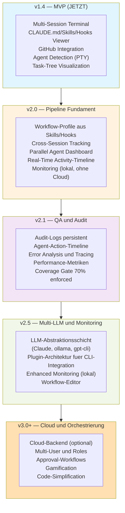
```mermaid
graph TD
    subgraph v1["v1.4 — MVP (JETZT)"]
        A["Multi-Session Terminal<br/>CLAUDE.md/Skills/Hooks Viewer<br/>GitHub Integration<br/>Agent Detection (PTY)<br/>Task-Tree Visualization"]
    end

    subgraph v2_0["v2.0 — Pipeline Fundament"]
        B["Workflow-Profile aus Skills/Hooks<br/>Cross-Session Tracking<br/>Parallel Agent Dashboard<br/>Real-Time Activity-Timeline<br/>Monitoring (lokal, ohne Cloud)"]
    end

    subgraph v2_1["v2.1 — QA und Audit"]
        C["Audit-Logs persistent<br/>Agent-Action-Timeline<br/>Error Analysis und Tracing<br/>Performance-Metriken<br/>Coverage Gate 70% enforced"]
    end

    subgraph v2_5["v2.5 — Multi-LLM und Monitoring"]
        D["LLM-Abstraktionsschicht<br/>(Claude, ollama, gpt-cli)<br/>Plugin-Architektur fuer CLI-Integration<br/>Enhanced Monitoring (lokal)<br/>Workflow-Editor"]
    end

    subgraph v3_0["v3.0+ — Cloud und Orchestrierung"]
        E["Cloud-Backend (optional)<br/>Multi-User und Roles<br/>Approval-Workflows<br/>Gamification<br/>Code-Simplification"]
    end

    v1 --> v2_0
    v2_0 --> v2_1
    v2_1 --> v2_5
    v2_5 --> v3_0

    style v1 fill:#e1f5ff
    style v2_0 fill:#fff3e0
    style v2_1 fill:#f3e5f5
    style v2_5 fill:#f1f8e9
    style v3_0 fill:#ffe0b2
```

| Phase | Kern-Features | Strategische Entscheidung |
|-------|---------------|--------------------------|
| **v1.4 (Jetzt)** | Agent-Erkennung, Task-Tree | Agent-Detection aus PTY-Output via Regex |
| **v2.0** | Workflow-Start, Cross-Session Tracking | `agentStore` sessionuebergreifend; Workflows aus Skills/Hooks |
| **v2.1** | QA-Haertung, Audit-Trail, Metriken | Coverage 70% Gate; Agent-Aktionen persistent geloggt |
| **v2.5** | Multi-LLM, Plugin-Architektur | Abstraktionsschicht fuer andere CLI-Tools (ollama, gpt-cli) |
| **v3.0+** | Cloud, Multi-User, Gamification | Erst wenn lokales Fundament stabil steht |

### 4.4 Entwicklungs-Workflow: Plan-First mit GitHub Issues

> **PO-Entscheidung:** "Immer erst Plan schreiben, brainstormen, Fragen hin und her, dann per Tickets abarbeiten."

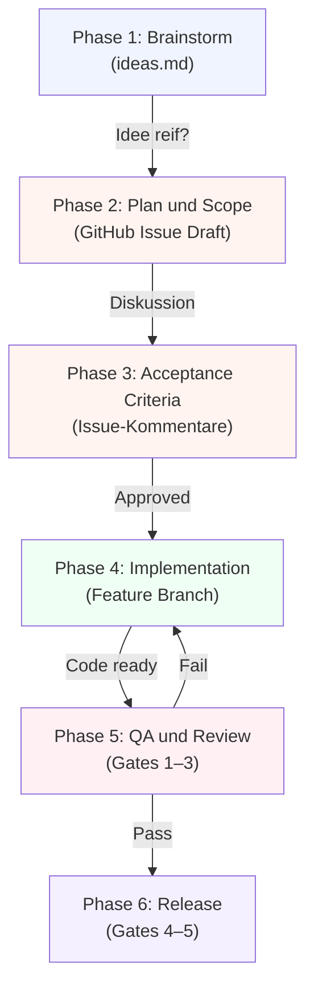
```mermaid
graph TD
    A["Phase 1: Brainstorm<br/>(ideas.md)"] -->|Idee reif?| B["Phase 2: Plan und Scope<br/>(GitHub Issue Draft)"]
    B -->|Diskussion| C["Phase 3: Acceptance Criteria<br/>(Issue-Kommentare)"]
    C -->|Approved| D["Phase 4: Implementation<br/>(Feature Branch)"]
    D -->|Code ready| E["Phase 5: QA und Review<br/>(Gates 1–3)"]
    E -->|Pass| F["Phase 6: Release<br/>(Gates 4–5)"]
    E -->|Fail| D

    style A fill:#f0f4ff
    style B fill:#fff4f0
    style C fill:#fff4f0
    style D fill:#f0fff4
    style E fill:#fff0f4
    style F fill:#f4f0ff
```

| Phase | Wer | Was | Tool | Done-Kriterium |
|-------|-----|-----|------|----------------|
| **1: Brainstorm** | Jeder | Ideen notieren, keine Filterung | `tasks/ideas.md` | Idee + Kontext erfasst |
| **2: Plan** | PO / Lead | Scope, Abhaengigkeiten, Risiken skizzieren | GitHub Issue (Draft) | Issue-Body mit Kontext |
| **3: Acceptance Criteria** | Team | Kriterien diskutieren, Fragen klaeren | Issue-Kommentare | AC eindeutig; Fragen beantwortet |
| **4: Implementation** | Dev | Feature im Branch, Tests mitentwickeln | Feature-Branch | Code + Tests; Pre-Commit gruen |
| **5: QA und Review** | Dev + Reviewer | Gates 1–3 durchlaufen | GitHub PR | PR approved + CI gruen |
| **6: Release** | Dev | Gates 4–5: Build, Deploy, Monitor | GitHub Release | Release publiziert |

**GitHub Issues Label-Schema:**

| Kategorie | Labels |
|-----------|--------|
| **Typ** | `type/bug`, `type/feature`, `type/enhancement`, `type/docs`, `type/test`, `type/chore` |
| **Prioritaet** | `prio/critical`, `prio/high`, `prio/medium`, `prio/low` |
| **QA** | `qa/security-review`, `qa/needs-test`, `qa/tested`, `qa/ready-release` |
| **Status** | `status/backlog`, `status/in-planning`, `status/in-progress`, `status/review`, `status/released` |

**Branch-Konvention:**
- `feature/kurzbeschreibung` — Neues Feature
- `bugfix/kurzbeschreibung` — Bug Fix
- `test/kurzbeschreibung` — Test-only
- `docs/kurzbeschreibung` — Dokumentation

---

## 5. Bausteinsicht

### 5.1 Level 1 — Gesamtsystem

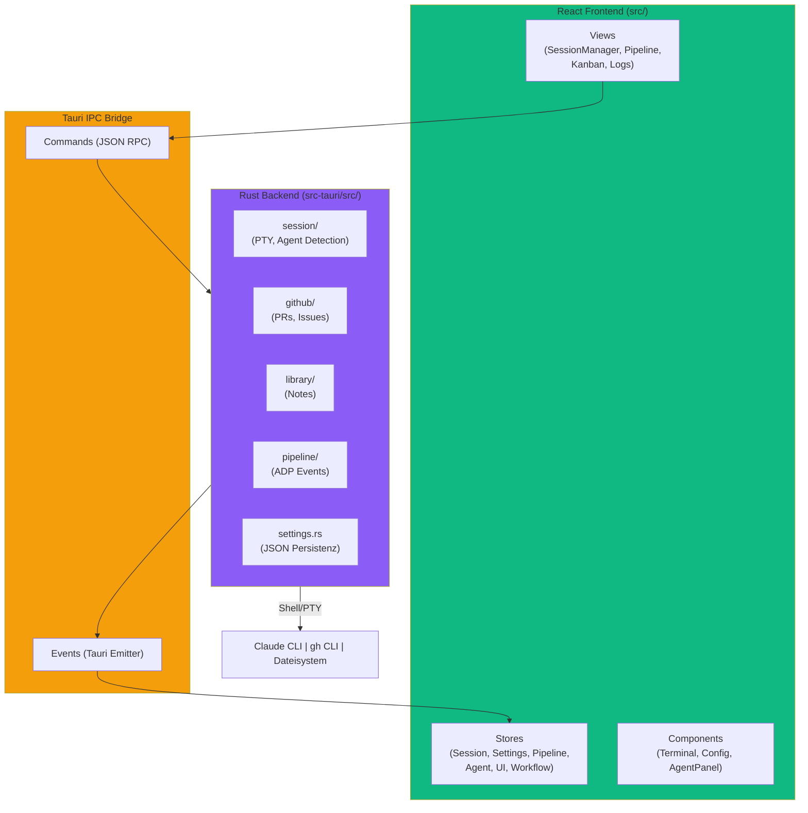
```mermaid
graph TB
    subgraph Frontend["React Frontend (src/)"]
        Views["Views<br/>(SessionManager, Pipeline,<br/>Kanban, Logs)"]
        Stores["Stores<br/>(Session, Settings, Pipeline,<br/>Agent, UI, Workflow)"]
        Comps["Components<br/>(Terminal, Config, AgentPanel)"]
    end

    subgraph IPC["Tauri IPC Bridge"]
        Commands["Commands (JSON RPC)"]
        Events["Events (Tauri Emitter)"]
    end

    subgraph Backend["Rust Backend (src-tauri/src/)"]
        Session["session/<br/>(PTY, Agent Detection)"]
        GitHubMod["github/<br/>(PRs, Issues)"]
        Library["library/<br/>(Notes)"]
        Pipeline["pipeline/<br/>(ADP Events)"]
        SettingsMod["settings.rs<br/>(JSON Persistenz)"]
    end

    External["Claude CLI | gh CLI | Dateisystem"]

    Views --> Commands
    Events --> Stores
    Commands --> Backend
    Backend --> Events
    Backend -->|Shell/PTY| External

    style Frontend fill:#10b981
    style IPC fill:#f59e0b
    style Backend fill:#8b5cf6
```

### 5.2 Level 2 — Frontend-Komponenten

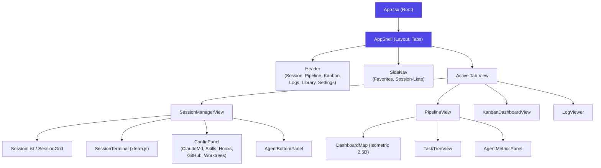
```mermaid
graph TD
    App["App.tsx (Root)"]
    Shell["AppShell (Layout, Tabs)"]

    App --> Shell
    Shell --> Header["Header<br/>(Session, Pipeline, Kanban,<br/>Logs, Library, Settings)"]
    Shell --> SideNav["SideNav<br/>(Favorites, Session-Liste)"]
    Shell --> Content["Active Tab View"]

    Content --> SessionMgr["SessionManagerView"]
    Content --> PipelineView["PipelineView"]
    Content --> KanbanView["KanbanDashboardView"]
    Content --> LogView["LogViewer"]

    SessionMgr --> SessionList["SessionList / SessionGrid"]
    SessionMgr --> Terminal["SessionTerminal (xterm.js)"]
    SessionMgr --> ConfigPanel["ConfigPanel<br/>(ClaudeMd, Skills, Hooks,<br/>GitHub, Worktrees)"]
    SessionMgr --> BottomPanel["AgentBottomPanel"]

    PipelineView --> Dashboard["DashboardMap (Isometric 2.5D)"]
    PipelineView --> TaskTree["TaskTreeView"]
    PipelineView --> Metrics["AgentMetricsPanel"]

    style App fill:#4f46e5,color:#fff
    style Shell fill:#4f46e5,color:#fff
```

**Zustand Stores:**

| Store | Typ | Verantwortung |
|-------|-----|---------------|
| `sessionStore` | Ephemeral | Session-CRUD, Status, PTY-Output |
| `settingsStore` | Persistent | Favoriten, Notizen, Theme, API-Keys |
| `uiStore` | Ephemeral | Tabs, Toasts, UI-Flags |
| `pipelineStore` | Ephemeral | Pipeline-State, Worktrees, QA-Gate |
| `agentStore` | Ephemeral | Erkannte Agenten, Hierarchie |
| `workflowStore` | Ephemeral | Skill/Hook-basierte Workflows |
| `editorStore` | Ephemeral | Markdown-Editor-State |

### 5.3 Level 2 — Backend-Module (Rust)

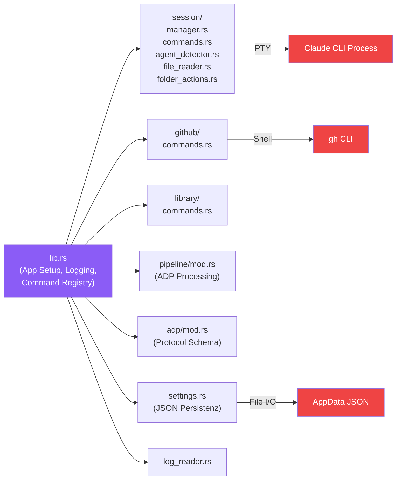
```mermaid
graph LR
    lib["lib.rs<br/>(App Setup, Logging,<br/>Command Registry)"]

    lib --> session["session/<br/>manager.rs<br/>commands.rs<br/>agent_detector.rs<br/>file_reader.rs<br/>folder_actions.rs"]
    lib --> github["github/<br/>commands.rs"]
    lib --> library["library/<br/>commands.rs"]
    lib --> pipeline["pipeline/mod.rs<br/>(ADP Processing)"]
    lib --> adp["adp/mod.rs<br/>(Protocol Schema)"]
    lib --> settings["settings.rs<br/>(JSON Persistenz)"]
    lib --> logs["log_reader.rs"]

    session -->|PTY| ext1["Claude CLI Process"]
    github -->|Shell| ext2["gh CLI"]
    settings -->|File I/O| ext3["AppData JSON"]

    style lib fill:#8b5cf6,color:#fff
    style ext1 fill:#ef4444,color:#fff
    style ext2 fill:#ef4444,color:#fff
    style ext3 fill:#ef4444,color:#fff
```

| Modul | Verantwortung |
|-------|---------------|
| **session::manager** | PTY-Lifecycle (spawn, write, resize, close); Event Emitting |
| **session::file_reader** | Datei-I/O (CLAUDE.md, Skills, Hooks lesen); Path Safety |
| **session::commands** | IPC Layer; Input Validation; Tauri Command Handlers |
| **session::agent_detector** | Agent-Typ-Erkennung via Regex (36 Unit-Tests) |
| **github::commands** | GitHub CLI Wrapper; Issue/PR Data; Kanban Sync |
| **library::commands** | Lokale Snippet-DB; Read/Write/Index |
| **settings** | User Config Persistierung mit Backup-Rotation |
| **pipeline** | ADP Event Processing |
| **adp** | Protocol Schema Validation, Error Types |

---

## 6. Laufzeitsicht

### 6.1 Session-Lifecycle

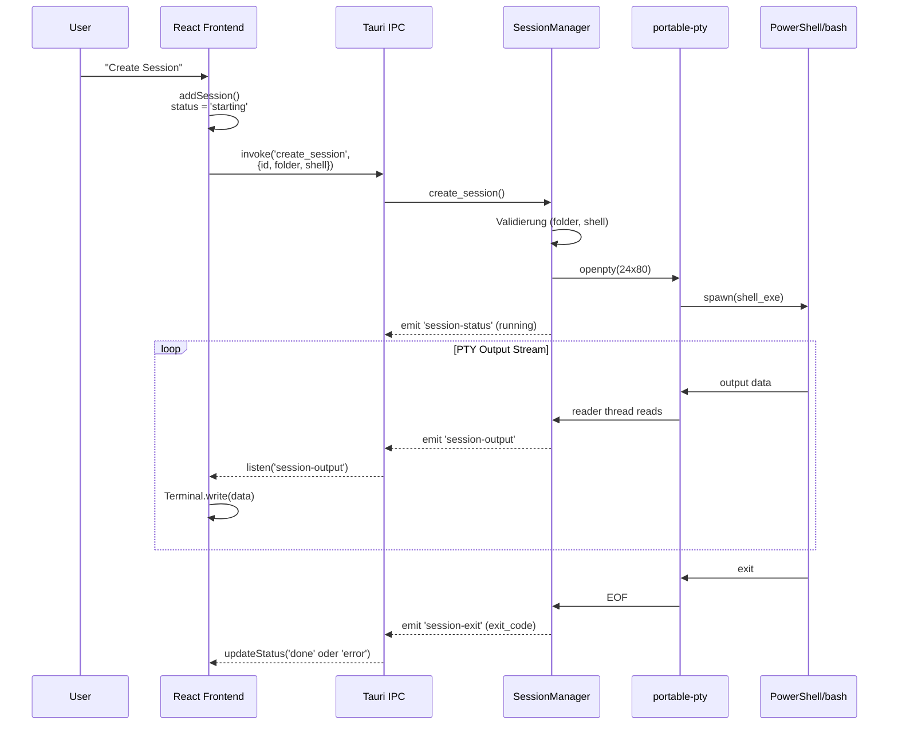
```mermaid
sequenceDiagram
    participant User
    participant Frontend as React Frontend
    participant IPC as Tauri IPC
    participant Backend as SessionManager
    participant PTY as portable-pty
    participant Shell as PowerShell/bash

    User->>Frontend: "Create Session"
    Frontend->>Frontend: addSession()<br/>status = 'starting'
    Frontend->>IPC: invoke('create_session',<br/>{id, folder, shell})

    IPC->>Backend: create_session()
    Backend->>Backend: Validierung (folder, shell)
    Backend->>PTY: openpty(24x80)
    PTY->>Shell: spawn(shell_exe)
    Backend-->>IPC: emit 'session-status' (running)

    loop PTY Output Stream
        Shell->>PTY: output data
        PTY->>Backend: reader thread reads
        Backend-->>IPC: emit 'session-output'
        IPC-->>Frontend: listen('session-output')
        Frontend->>Frontend: Terminal.write(data)
    end

    Shell->>PTY: exit
    PTY->>Backend: EOF
    Backend-->>IPC: emit 'session-exit' (exit_code)
    IPC-->>Frontend: updateStatus('done' oder 'error')
```

### 6.2 Session-Status State Machine

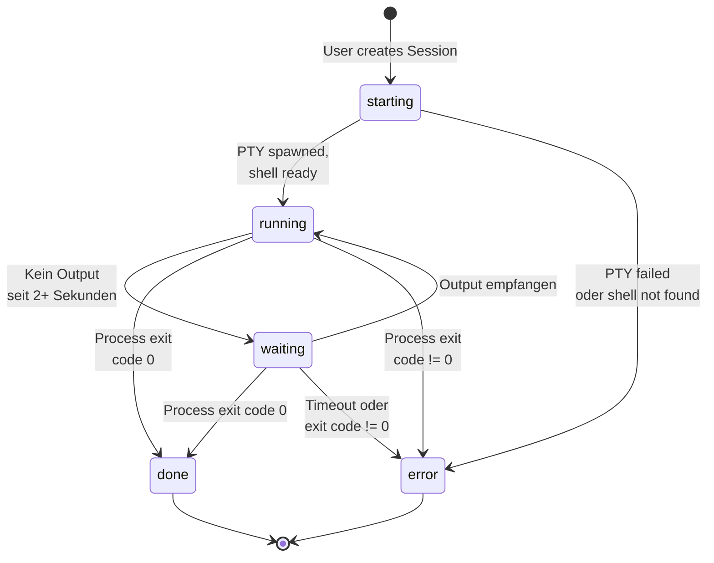
```mermaid
stateDiagram-v2
    [*] --> starting: User creates Session

    starting --> running: PTY spawned,<br/>shell ready
    starting --> error: PTY failed<br/>oder shell not found

    running --> waiting: Kein Output<br/>seit 2+ Sekunden
    running --> done: Process exit<br/>code 0
    running --> error: Process exit<br/>code != 0

    waiting --> running: Output empfangen
    waiting --> done: Process exit code 0
    waiting --> error: Timeout oder<br/>exit code != 0

    done --> [*]
    error --> [*]
```

### 6.3 Agent-Erkennung

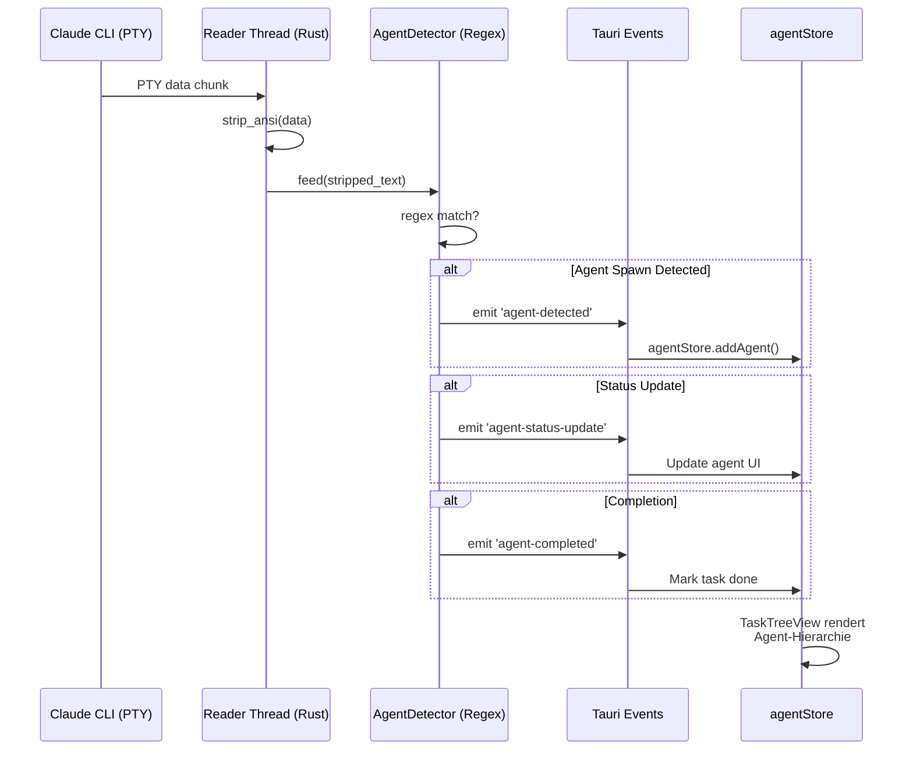
```mermaid
sequenceDiagram
    participant Shell as Claude CLI (PTY)
    participant Reader as Reader Thread (Rust)
    participant Detector as AgentDetector (Regex)
    participant IPC as Tauri Events
    participant Frontend as agentStore

    Shell->>Reader: PTY data chunk
    Reader->>Reader: strip_ansi(data)
    Reader->>Detector: feed(stripped_text)
    Detector->>Detector: regex match?

    alt Agent Spawn Detected
        Detector->>IPC: emit 'agent-detected'
        IPC->>Frontend: agentStore.addAgent()
    end

    alt Status Update
        Detector->>IPC: emit 'agent-status-update'
        IPC->>Frontend: Update agent UI
    end

    alt Completion
        Detector->>IPC: emit 'agent-completed'
        IPC->>Frontend: Mark task done
    end

    Frontend->>Frontend: TaskTreeView rendert<br/>Agent-Hierarchie
```

### 6.4 Settings-Persistenz

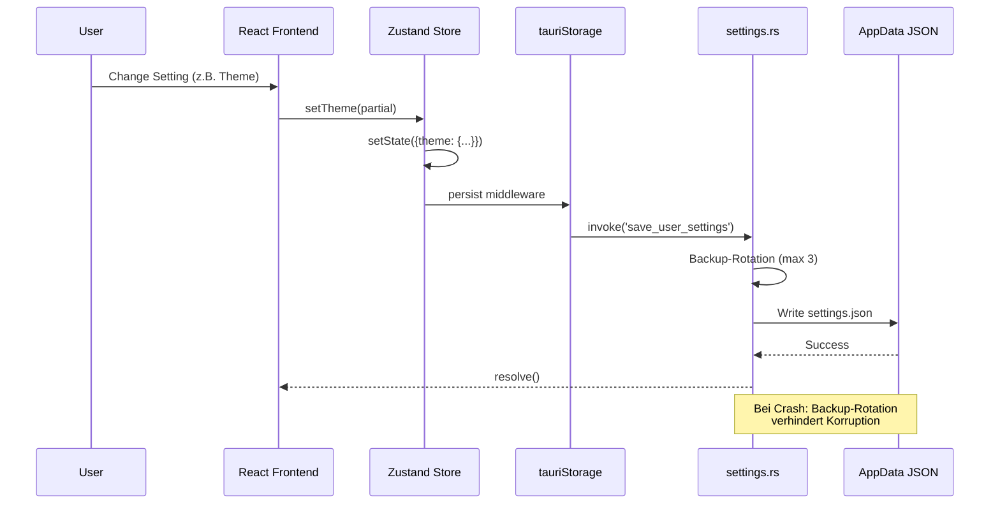
```mermaid
sequenceDiagram
    participant User
    participant Frontend as React Frontend
    participant Zustand as Zustand Store
    participant Storage as tauriStorage
    participant Backend as settings.rs
    participant FS as AppData JSON

    User->>Frontend: Change Setting (z.B. Theme)
    Frontend->>Zustand: setTheme(partial)
    Zustand->>Zustand: setState({theme: {...}})
    Zustand->>Storage: persist middleware
    Storage->>Backend: invoke('save_user_settings')
    Backend->>Backend: Backup-Rotation (max 3)
    Backend->>FS: Write settings.json
    FS-->>Backend: Success
    Backend-->>Frontend: resolve()

    Note over Backend,FS: Bei Crash: Backup-Rotation<br/>verhindert Korruption
```

### 6.5 GitHub-Datenfluss

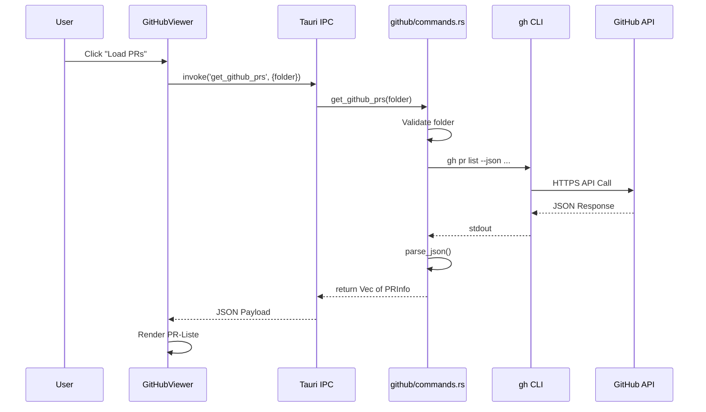
```mermaid
sequenceDiagram
    participant User
    participant Frontend as GitHubViewer
    participant IPC as Tauri IPC
    participant Backend as github/commands.rs
    participant Shell as gh CLI
    participant GitHub as GitHub API

    User->>Frontend: Click "Load PRs"
    Frontend->>IPC: invoke('get_github_prs', {folder})
    IPC->>Backend: get_github_prs(folder)
    Backend->>Backend: Validate folder
    Backend->>Shell: gh pr list --json ...
    Shell->>GitHub: HTTPS API Call
    GitHub-->>Shell: JSON Response
    Shell-->>Backend: stdout
    Backend->>Backend: parse_json()
    Backend-->>IPC: return Vec of PRInfo
    IPC-->>Frontend: JSON Payload
    Frontend->>Frontend: Render PR-Liste
```

### 6.6 IPC-Kommunikationsmuster

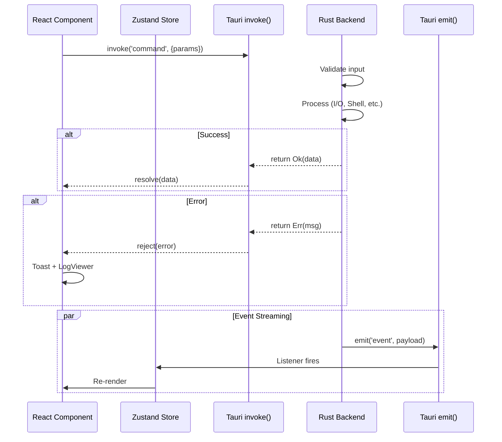
```mermaid
sequenceDiagram
    participant React as React Component
    participant Store as Zustand Store
    participant IPC as Tauri invoke()
    participant Backend as Rust Backend
    participant Emit as Tauri emit()

    React->>IPC: invoke('command', {params})

    Backend->>Backend: Validate input
    Backend->>Backend: Process (I/O, Shell, etc.)

    alt Success
        Backend-->>IPC: return Ok(data)
        IPC-->>React: resolve(data)
    end

    alt Error
        Backend-->>IPC: return Err(msg)
        IPC-->>React: reject(error)
        React->>React: Toast + LogViewer
    end

    par Event Streaming
        Backend->>Emit: emit('event', payload)
        Emit->>Store: Listener fires
        Store->>React: Re-render
    end
```

---

## 7. Verteilungssicht

### 7.1 Build-Pipeline und Artefakte

```mermaid
graph LR
    Source["Source Code<br/>(Git Repo)"]

    Build["Build<br/>(Vite + Cargo)"]
    Test["Test<br/>(Vitest, cargo test)"]
    Sign["Sign<br/>(ECDSA)"]
    Release["Release<br/>(GitHub)"]

    Download["Download (HTTPS)"]
    Verify["Verify Signature"]
    Install["Install (NSIS)"]
    Run["Run App"]
    Update["Auto-Update Check"]

    Source -->|git push| Build
    Build -->|artifacts| Test
    Test -->|OK| Sign
    Sign -->|.exe + .sig| Release
    Release -->|latest.json| Download
    Download -->|.exe + .sig| Verify
    Verify -->|valid| Install
    Install -->|NSIS| Run
    Run -->|Startup| Update
    Update -->|neue Version?| Download

    style Build fill:#10b981
    style Test fill:#10b981
    style Sign fill:#f59e0b
    style Release fill:#f59e0b
    style Install fill:#06b6d4
```

### 7.2 Systemvoraussetzungen

| Anforderung | Details |
|-------------|---------|
| OS | Windows 7+ / Server 2008 R2+ |
| Runtime | WebView2 (Tauri v2 auf Windows) |
| Abhängigkeiten | Claude CLI installiert + im PATH |
| Optional | `gh` CLI für GitHub-Integration |
| RAM | Min. 150 MB (Idle), ~300 MB bei 4+ Sessions |

### 7.3 Auto-Updater

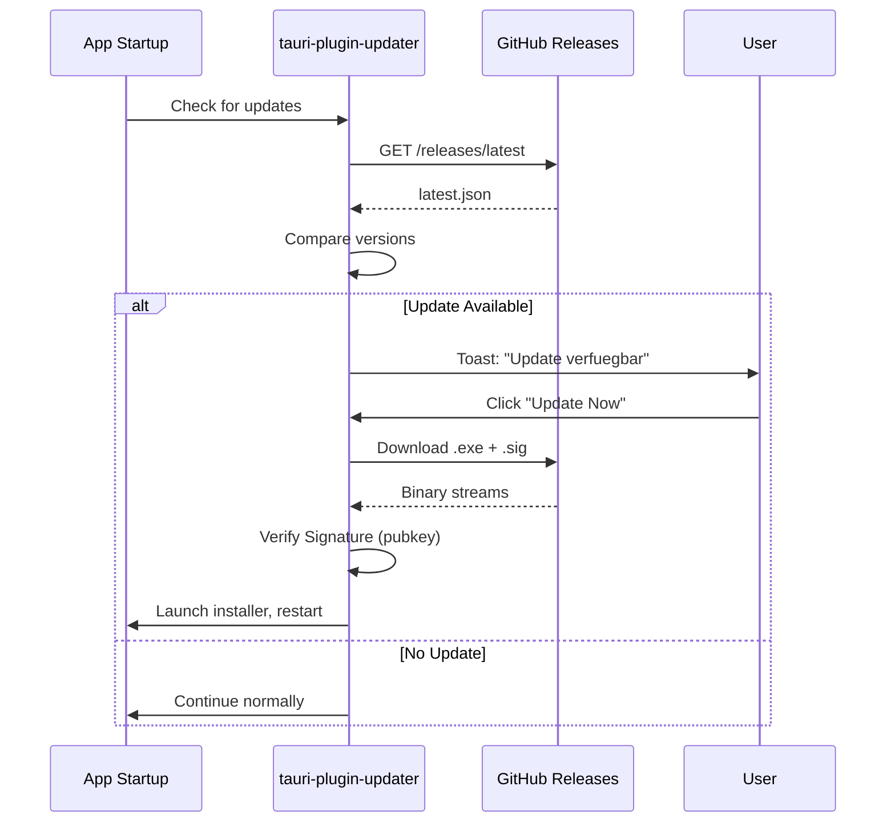
```mermaid
sequenceDiagram
    participant App as App Startup
    participant Updater as tauri-plugin-updater
    participant GitHub as GitHub Releases
    participant User

    App->>Updater: Check for updates
    Updater->>GitHub: GET /releases/latest
    GitHub-->>Updater: latest.json

    Updater->>Updater: Compare versions

    alt Update Available
        Updater->>User: Toast: "Update verfuegbar"
        User->>Updater: Click "Update Now"
        Updater->>GitHub: Download .exe + .sig
        GitHub-->>Updater: Binary streams
        Updater->>Updater: Verify Signature (pubkey)
        Updater->>App: Launch installer, restart
    else No Update
        Updater->>App: Continue normally
    end
```

---

## 8. Querschnittliche Konzepte

### 8.1 Error-Handling-Strategie

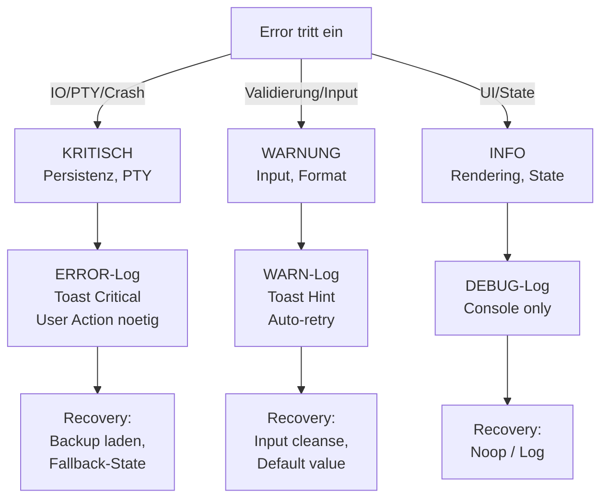
```mermaid
graph TD
    ERR["Error tritt ein"]

    ERR -->|IO/PTY/Crash| CAT1["KRITISCH<br/>Persistenz, PTY"]
    ERR -->|Validierung/Input| CAT2["WARNUNG<br/>Input, Format"]
    ERR -->|UI/State| CAT3["INFO<br/>Rendering, State"]

    CAT1 --> ESC1["ERROR-Log<br/>Toast Critical<br/>User Action noetig"]
    CAT2 --> ESC2["WARN-Log<br/>Toast Hint<br/>Auto-retry"]
    CAT3 --> ESC3["DEBUG-Log<br/>Console only"]

    ESC1 --> REC1["Recovery:<br/>Backup laden,<br/>Fallback-State"]
    ESC2 --> REC2["Recovery:<br/>Input cleanse,<br/>Default value"]
    ESC3 --> REC3["Recovery:<br/>Noop / Log"]
```

**Error Handling nach Schicht:**

| Schicht | Fehlertyp | Handling | Beispiel |
|---------|-----------|----------|----------|
| **Backend (Rust)** | Shell-Command Timeout | 30s Timeout; kill subprocess | `run_command()` timeout |
| **Backend (Rust)** | Path-Traversal | `safe_resolve()` + ERROR-log | `../../etc/passwd` blockiert |
| **Backend (Rust)** | Settings-Korruption | Backup-Rotation; letztes sauberes JSON | Crash waehrend Write |
| **IPC (Tauri)** | Command-Fehler | ADP-Error wrappen; `{code, message, stack}` | `invoke("spawn_session")` failed |
| **Frontend (React)** | Unerwarteter State | Error Boundary + Toast + Stack-Dump | Store undefined |
| **Frontend (React)** | Network-Timeout | Toast + Button disabled + Cache zeigen | `gh pr list` timeout |

### 8.2 Security

| Massnahme | Status | Details |
|----------|--------|---------|
| Input-Validierung | Implementiert | Shell-Injection-Whitelist (`[a-z0-9\-_]`) für Session-IDs |
| Path-Traversal-Schutz | Implementiert | `folder_path.exists()` + `is_dir()` Checks |
| Subprocess-Timeouts | Implementiert | Timeouts für `gh`/`git`/`claude` Prozesse |
| CSP-Policy | Teilweise | Aktiv, aber `'unsafe-eval'` noetig (Vite/HMR) |
| Secret-Management | Offen | API-Keys in Settings ohne Encryption |
| HTML-Sanitization | Implementiert | DOMPurify für Markdown-Rendering |

### 8.3 Persistenz

- **Technologie**: JSON-Dateien in AppData (via Tauri)
- **Backup**: Rotation mit max. 3 Versionen (seit v1.3.1)
- **State-Trennung**: Ephemeral (sessionStore) vs. Persistent (settingsStore)
- **Schwaeche**: Kein Atomic Write implementiert

### 8.4 Logging

| Level | Tool | Ziel |
|-------|------|------|
| **ERROR** | `log::error!()` + stderr | Kritische Fehler, User Action noetig |
| **WARN** | `log::warn!()` + File | Anomalien, Developer sollte wissen |
| **INFO** | `log::info!()` + File | Wichtige Events (Audit Trail) |
| **DEBUG** | `log::debug!()` + File only | Detaillierter Flow (Development) |

Frontend: `perfLogger.ts` mit 24 Instrumentierungspunkten (IPC/Event/Store/Render-Zeiten).
Backend: Rust `log` + `env_logger` nach `<AppData>/agentic-explorer.log`.

### 8.5 UI/UX-Konsistenz

- 100% Tailwind CSS Utility Classes
- Framer Motion für Animationen
- oklch Color-Tokens für konsistente Farbpalette
- Dark/Light Theme via `settingsStore`
- Custom CSS nur für 3D-Transforms (Isometric View)

---

## 9. Architekturentscheidungen (ADRs)

### ADR-1: Tauri v2 über Electron

- **Kontext**: Desktop-App für Claude CLI Session-Management
- **Entscheidung**: Tauri v2 mit Rust-Backend
- **Begründung**: Kleineres Bundle (~5 MB vs ~100 MB), nativer PTY-Zugriff via Rust
- **Konsequenzen**: Performant, sicher. Weniger Community-Plugins, CSP-Restriktionen.

### ADR-2: Zustand statt Redux

- **Kontext**: State-Management für 7+ Stores
- **Entscheidung**: Zustand mit Domain-Slices
- **Begründung**: Leichtgewichtig (4.5 KB), kein Boilerplate, natürliche Composition
- **Konsequenzen**: Einfach, performant. Keine DevTools, kein Time-Travel Debugging.

### ADR-3: PTY via portable-pty

- **Kontext**: Claude CLI muss als echtes Terminal laufen
- **Entscheidung**: `portable-pty 0.8` im Rust-Backend
- **Begründung**: Cross-Platform PTY, mature Library, ANSI-Kompatibilität
- **Konsequenzen**: Echtes Terminal-Erlebnis. Async-Komplexität, Fehler schwer zu debuggen.

### ADR-4: Ephemeraler vs. Persistierter State

- **Kontext**: Session-Daten flüchtig, Settings persistent
- **Entscheidung**: Strikte Trennung in separate Stores
- **Begründung**: Vermeidung von Datenverlust-Risiken; klare Verantwortlichkeiten
- **Konsequenzen**: Sauber. Settings brauchen explizite Migration bei Struktur-Aenderungen.

### ADR-5: ADP-Protokoll für Agent-Erkennung

- **Kontext**: Pipeline-View braucht strukturierte Agent-Daten
- **Entscheidung**: Regex-basierte Erkennung auf PTY-Output
- **Begründung**: Kein API-Zugang zu Claude CLI Internals; Output-Parsing einziger Weg
- **Konsequenzen**: Funktioniert ohne CLI-Aenderungen. Fragil (abhängig von Output-Format).

### ADR-6: GitHub CLI statt REST API

- **Kontext**: GitHub-Integration für PRs/Issues
- **Entscheidung**: `gh` CLI via Shell statt direkte GitHub API
- **Begründung**: Keine extra API-Keys; nutzt lokale `gh auth`
- **Konsequenzen**: Zero-Config. Abhängig von `gh` Installation; Shell-Overhead.

---

## 10. Qualitätsanforderungen

### 10.1 Qualitätsbaum

```mermaid
graph TD
    Q["AgenticExplorer Qualitaet"]

    Q --> R["Zuverlaessigkeit"]
    Q --> S["Sicherheit"]
    Q --> P["Performance"]
    Q --> U["Usability"]
    Q --> M["Wartbarkeit"]

    R --> R1["Session-Persistenz (P0)"]
    R --> R2["PTY-Lifecycle (P0)"]
    R --> R3["Settings-Crash-Safety (P0)"]
    R --> R4["Graceful Degradation (P1)"]

    S --> S1["Shell-Injection-Schutz (P0)"]
    S --> S2["Path-Traversal-Schutz (P0)"]
    S --> S3["Input-Validierung (P0)"]
    S --> S4["Secret-Management (P2)"]

    P --> P1["Output-Latenz unter 100ms (P1)"]
    P --> P2["App-Start unter 2s (P1)"]
    P --> P3["RAM unter 150MB idle (P2)"]

    U --> U1["Kontext-Wechsel unter 1s (P1)"]
    U --> U2["Fehler verstaendlich (P2)"]

    M --> M1["Type-Safety 100% (P1)"]
    M --> M2["Test-Coverage 70%+ (P1)"]
    M --> M3["CI/Local-Paritaet (P1)"]
    M --> M4["Automatisierte Gates (P1)"]

    style Q fill:#4f46e5,color:#fff
    style R fill:#10b981,color:#fff
    style S fill:#ef4444,color:#fff
    style P fill:#f59e0b,color:#fff
    style U fill:#8b5cf6,color:#fff
    style M fill:#06b6d4,color:#fff
```

### 10.2 Qualitätsszenarien

| # | Szenario | Stimulus | Reaktion | Metrik | Prio |
|---|----------|----------|----------|--------|------|
| QS-1 | **Crash-Safety** | App crasht waehrend Settings-Write | Backup-Rotation; Recovery beim Start | Settings intakt nach Restart | P0 |
| QS-2 | **Shell-Injection** | Session-ID `$(rm -rf /)` | Input-Whitelist blockt; Error geloggt | Nur `[a-z0-9\-_]` akzeptiert | P0 |
| QS-3 | **Path-Traversal** | `../../../etc/passwd` | `safe_resolve` blockiert; Access denied | Zugriff verweigert | P0 |
| QS-4 | **Output-Latenz** | Claude CLI Output 100 Zeilen | Terminal live-Update | < 100ms, kein Jank | P1 |
| QS-5 | **Multi-Session** | 5 Sessions parallel | Kein Memory-Leak, kein Freeze | RAM < 300 MB, FPS >= 60 | P1 |
| QS-6 | **Error-Reporting** | Backend-Timeout | Error-Toast mit Logfile-Link | User kann Root Cause finden | P1 |
| QS-7 | **CI/Local-Paritaet** | Pre-Commit lokal | Identisch zu CI Pipeline | Kein "Works on my machine" | P1 |
| QS-8 | **App-Start** | User startet .exe | WebView + Backend ready | < 2 Sekunden | P1 |
| QS-9 | **Security-Review Gate** | Neuer Tauri-Command | 5-Punkte-Checkliste geprueft | PR blockiert ohne Checkliste | P0 |
| QS-10 | **Coverage-Gate** | PR mit neuem Feature | Coverage >= 70% global | CI blockiert bei Unterschreitung | P1 |

### 10.3 QA-Gate-Modell

#### Überblick: 5 Quality Gates

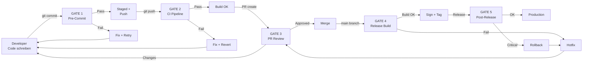
```mermaid
graph LR
    DEV["Developer<br/>Code schreiben"]

    DEV -->|git commit| G1["GATE 1<br/>Pre-Commit"]
    G1 -->|Pass| PUSH["Staged +<br/>Push"]
    G1 -->|Fail| FIX1["Fix + Retry"]
    FIX1 --> DEV

    PUSH -->|git push| G2["GATE 2<br/>CI Pipeline"]
    G2 -->|Pass| BUILD["Build OK"]
    G2 -->|Fail| FIX2["Fix + Revert"]
    FIX2 --> DEV

    BUILD -->|PR create| G3["GATE 3<br/>PR Review"]
    G3 -->|Approved| MERGE["Merge"]
    G3 -->|Changes| DEV

    MERGE -->|main branch| G4["GATE 4<br/>Release Build"]
    G4 -->|Build OK| SIGN["Sign + Tag"]
    G4 -->|Fail| HOTFIX["Hotfix"]
    HOTFIX --> G3

    SIGN -->|Release| G5["GATE 5<br/>Post-Release"]
    G5 -->|OK| LIVE["Production"]
    G5 -->|Critical| ROLLBACK["Rollback"]
    ROLLBACK --> HOTFIX
```

#### Gate 1: PRE-COMMIT (Lokal)

| Aspekt | Details |
|--------|---------|
| **Wann** | Vor jedem `git commit` (Husky Hook) |
| **Tools** | `tsc --noEmit` + `eslint --max-warnings=0` (TS); `cargo fmt --check` + `cargo check` (Rust) |
| **Pass-Kriterien** | Alle Checks gruen; keine Warnungen |
| **Fail-Handling** | Commit blockiert; Developer fixt |
| **Timeout** | 60 Sekunden |

#### Gate 2: CI PIPELINE (GitHub Actions)

| Aspekt | Details |
|--------|---------|
| **Wann** | Auf jedem Push zu `master` + PR |
| **Jobs** | Frontend (TS/Lint), Rust (Clippy/fmt), Tests (Vitest + Cargo), Coverage |
| **Coverage-Schwelle** | Statements: 70%, Branches: 60%, Functions: 70%, Lines: 70% |
| **Pass-Kriterien** | Alle Jobs erfolgreich; Coverage >= Schwellen |
| **Fail-Handling** | PR blockiert fuer Merge |
| **Timeout** | 15 Minuten |

#### Gate 3: PR REVIEW (Manuell + Automatisiert)

| Aspekt | Details |
|--------|---------|
| **Wann** | Nach PR-Erstellung; vor Merge |
| **Reviewer** | Min. 1 Maintainer; Security-Review fuer Tauri-Commands |
| **Security-Checkliste** | (1) Input validiert? (2) Path Traversal? (3) Shell-Injection? (4) Timeout? (5) Fehler strukturiert? |
| **Test-Checkliste** | (1) Feature-Tests geschrieben? (2) Edge Cases abgedeckt? (3) Coverage-Anstieg sichtbar? |
| **Pass-Kriterien** | +1 Approval, CI gruen, alle Conversations geloest |

#### Gate 4: RELEASE BUILD

| Aspekt | Details |
|--------|---------|
| **Wann** | Vor Tag-Erstellung + GitHub Release |
| **Automation** | `/release` Skill (`.claude/skills/release/SKILL.md`) fuehrt alle Phasen aus |
| **Pre-Release-Checkliste** | (1) Branch = `master`? (2) Working Tree clean? (3) Up-to-date mit origin? (4) `npx tsc --noEmit` gruen? (5) `npm run test` gruen? (6) `npm run build` gruen? (7) `cargo check` gruen? (8) CHANGELOG.md aktualisiert? (9) Version in **drei Dateien** konsistent (`package.json`, `src-tauri/tauri.conf.json`, `src-tauri/Cargo.toml`)? (10) Archivierungs-Check fuer abgeschlossene Sprint-Docs? |
| **Tag-Konvention** | `vMAJOR.MINOR.PATCH` (SemVer 2.0), annotated Tag mit Sprint-Name: `git tag -a v1.5.0 -m "v1.5.0 Kompass — ..."` |
| **Version-Bump-Regeln** | `feat(...)` Commits → MINOR, nur `fix/chore/refactor/docs` → PATCH, `BREAKING CHANGE:` im Body → MAJOR |
| **Release-Flow** | 1) `/release [patch\|minor\|major]` → 2) Skill prueft Gates → 3) Version bumpen → 4) CHANGELOG-Block generieren → 5) **⏸️ User-Review** → 6) Commit + annotated Tag → 7) `git push && git push --tags` → 8) `gh release create` mit CHANGELOG-Body → 9) `tasks/todo.md` Sprint als abgeschlossen markieren |
| **Pass-Kriterien** | Alle Gates gruen, Version konsistent, Tag gepusht, GitHub-Release online |
| **Fail-Handling** | Gate A (Pre-Flight) rot → User fixt; Gate B (Quality) rot → Release ABBRUCH; `git push` failed → Tag lokal loeschen, pullen, neu pushen; `gh release create` failed → Tag ist bereits gepusht, Release manuell nachziehen |

#### Gate 5: POST-RELEASE MONITORING

| Aspekt | Details |
|--------|---------|
| **Wann** | Erste 24 Stunden nach Release intensiv |
| **Monitoring** | Error-Logs, Crash-Reports (GitHub Issues), User-Feedback |
| **Metriken** | Error Rate < 0.1%, Session-Crashes = 0 |
| **Rollback-Window** | 24 Stunden nach Release |

#### Testzyklen-Übersicht

```mermaid
graph TD
    DEV["Developer Code"]

    DEV -->|Keystroke| UT["Unit Tests (Vitest Watch)<br/>~500ms"]
    DEV -->|git commit| COMMIT["Pre-Commit Hook"]
    COMMIT --> TSC["TypeScript Check"]
    COMMIT --> LINT["ESLint + Prettier"]
    COMMIT --> CARGO["Rust: fmt + check"]

    COMMIT -->|Pass| PUSH["git push"]
    PUSH -->|CI trigger| CI["CI PIPELINE"]

    CI --> S1["Stage 1: Lint<br/>(ESLint + Clippy)"]
    CI --> S2["Stage 2: Unit Tests<br/>(Vitest + cargo test)"]
    CI --> S3["Stage 3: Coverage Gate<br/>(70%+ enforced)"]
    CI --> S4["Stage 4: Integration<br/>(Future: Component + IPC)"]
    CI --> S5["Stage 5: E2E<br/>(Future: Full App Flow)"]

    CI -->|All green| MERGE["Merge to master"]
    CI -->|Fail| BLOCK["Block Merge"]

    MERGE --> REL["Release Build"]
    REL --> SMOKE["Smoke Tests (Post-Release)"]
    SMOKE --> PROD["Production"]
```

#### Test-Pyramide (Ziel-Verteilung)

| Schicht | Anteil | Tests (Ziel) | Tool | Status |
|---------|--------|-------------|------|--------|
| **Unit Tests** | 40% | ~250 (Stores, Pure Functions) | Vitest + jsdom | 251 vorhanden |
| **Component Tests** | 20% | ~50 (Rendering, State Changes) | Vitest + @testing-library/react | 0 — offen |
| **Integration Tests** | 30% | ~60 (IPC, Persistenz, Security) | Vitest + MSW (Tauri-IPC-Mocks) | 0 — offen |
| **E2E Tests** | 10% | ~10 (Kritische Smoke-Tests) | WebdriverIO + tauri-driver | 0 — offen |
| **Gesamt** | 100% | ~370 Tests | — | 251 aktuell |

#### E2E-Testing-Strategie (WebdriverIO + Tauri)

> **PO-Entscheidung:** "Wir wollen die App an sich die startet testen — wie ein Test-Manager es fordern wuerde."

Tauri empfiehlt offiziell **WebdriverIO** fuer E2E-Tests. Der Ansatz startet die tatsaechlich kompilierte App und testet sie ueber das WebDriver-Protokoll.

```mermaid
sequenceDiagram
    participant Test as WebdriverIO Test
    participant TD as tauri-driver
    participant EW as Edge WebDriver
    participant App as Tauri App (.exe)
    participant WV as WebView (React UI)

    Test->>TD: WebDriver Command (HTTP)
    TD->>EW: Forward Command
    EW->>App: Startet/Steuert App
    App->>WV: React UI rendert
    EW-->>TD: Response (DOM, Screenshots)
    TD-->>Test: Test-Ergebnis
```

**Voraussetzungen:**
- `tauri-driver` (Rust Binary, via `cargo install tauri-driver`)
- `msedgedriver.exe` im PATH (passend zur installierten Edge-Version)
- App muss vorher gebaut sein (`npm run tauri build`)

**MVP Smoke-Tests (Top 8):**

| # | Smoke-Test | Verifiziert |
|---|-----------|-------------|
| 1 | App startet, Sidebar sichtbar | Grundfunktion |
| 2 | Session erstellen, erscheint in Liste | Session-CRUD |
| 3 | Session oeffnen, Terminal-Tab sichtbar | PTY-Integration |
| 4 | CLAUDE.md Tab zeigt Inhalt | Datei-Lesen |
| 5 | Theme-Wechsel Dark/Light | Settings-Persistenz |
| 6 | Favorit markieren, erscheint in Sidebar | Favoriten-System |
| 7 | Tab-Navigation Sessions/Pipeline/Kanban | UI-Routing |
| 8 | Toast-Benachrichtigung erscheint | Feedback-System |

**Aufwand-Schaetzung:**

| Phase | Aufwand | Ergebnis |
|-------|---------|----------|
| Component-Tests | 2–3 Tage | 30+ Tests, Coverage auf ~70% |
| WebdriverIO Setup | 2–3 Tage | Infrastruktur + 1 Smoke-Test |
| E2E Smoke Suite | 2–3 Tage | 8 Smoke-Tests + CI-Integration |
| **Gesamt MVP** | **~7–9 Tage** | Solides Test-Setup mit E2E |

**CI-Integration:**

```mermaid
graph LR
    A["Push/PR"] --> B["Lint + Type-Check"]
    B --> C["Unit + Component Tests"]
    C --> D["Coverage Gate 70%"]
    D --> E["Build Tauri App"]
    E --> F["E2E Smoke Tests"]
    F -->|Pass| G["Artefakte + Report"]
    F -->|Fail| X["Abbruch"]
```

#### MCP-Server fuer Testing

| MCP-Server | Nutzen fuer AgenticExplorer | Einschraenkung |
|------------|---------------------------|----------------|
| Playwright MCP | Visuelles Regressions-Testing gegen Dev-Server (`:5173`) | Nur WebView, nicht native Shell |
| GitHub MCP | CI-Status pruefen, Test-Ergebnisse abfragen | Kein direktes Testing |
| File System MCP | Coverage-Reports lesen und analysieren | Nur Lese-Zugriff |

**Fazit:** Kein MCP-Server kann aktuell eine Tauri .exe starten und steuern. Der groesste MCP-Nutzen liegt bei visuellen Regressions-Checks des Dev-Servers und CI-Status-Abfragen. Fuer echte App-Tests bleibt WebdriverIO + tauri-driver der einzige Weg.

---

## 11. Risiken und technische Schulden

### 11.1 Risiken

| # | Risiko | Wahrsch. | Impact | Mitigation (QA-Gate) | Status |
|---|--------|----------|--------|----------------------|--------|
| R-1 | Agent-Erkennung bricht bei Claude CLI Update | HOCH | HOCH | Gate 3: Regex versioniert; Monitoring Post-Release | Mitigiert |
| R-2 | Persistenz-Korruption bei Crash | MITTEL | KRITISCH | Gate 4: Pre-Release Audit; Atomic Write fehlt | Offen |
| R-3 | CSP `unsafe-eval` als Angriffsvektor | NIEDRIG | MITTEL | Akzeptiert (Vite-Zwang); nur lokale App | Akzeptiert |
| R-4 | `gh` CLI nicht installiert | MITTEL | NIEDRIG | Graceful Degradation; GitHub-Tab zeigt Hinweis | Mitigiert |
| R-5 | PTY-Kompatibilitaet Windows/PowerShell | NIEDRIG | HOCH | Gate 2: Integration Tests; portable-pty ausgereift | Offen |
| R-6 | Memory-Leak bei Multi-Session | NIEDRIG | MITTEL | Gate 2: Perf-Tests; Gate 5: RAM-Monitoring | Offen |
| R-7 | Settings ueberschreiben sich parallel | MITTEL | KRITISCH | Backup-Rotation + Lock-Datei | Mitigiert |
| R-8 | Fehlende Test-Coverage (24% aktuell) | HOCH | MITTEL | Gate 2: Coverage-Gate >= 70% (CI-erzwungen) | Offen |

### 11.2 Technische Schulden

| # | Schuld | Bereich | Schwere | Naechster Schritt |
|---|--------|---------|---------|-------------------|
| TD-1 | 0% Component-/E2E-Tests | Testing | KRITISCH | 130 Tests schreiben (Component + Integration + E2E) |
| TD-2 | Kein Atomic Write | Persistenz | MITTEL | Rust: temp-file + rename Pattern implementieren |
| TD-3 | Coverage-Schwelle zu niedrig | Testing | HOCH | vitest.config.ts: 24% auf 70% erhoehen |
| TD-4 | Kein Remote-Error-Tracking | Monitoring | MITTEL | Error-Logs an Discord/Slack (Post-Release) |
| TD-5 | Pipeline nur Mock-Modus | Feature | NIEDRIG | Real-Mode in v2.0 |
| TD-6 | Secret-Management fehlt | Security | MITTEL | API-Keys verschluesseln (OS Keychain) |

---

## 12. Glossar

| Begriff | Definition |
|---------|------------|
| **ADP** | Agentic Dashboard Protocol — Internes Protokoll für Pipeline-Events |
| **Agent** | Claude CLI Instanz oder Sub-Agent, erkannt via PTY-Output-Parsing |
| **AppData** | Betriebssystem-spezifischer Ordner für persistente App-Daten |
| **Claude CLI** | Anthropics Kommandozeilen-Tool für Claude AI Interaktion |
| **CSP** | Content Security Policy — Browser-Sicherheitsrichtlinie |
| **IPC** | Inter-Process Communication — Frontend-Backend Kommunikation |
| **Pipeline** | Orchestrierte Folge von Agent-Tasks (Plan, Code, Review, QA) |
| **PTY** | Pseudo-Terminal — Virtuelle Terminal-Schnittstelle für CLI-Prozesse |
| **QA-Gate** | Quality Gate — Qualitaetspruefpunkt im Entwicklungsprozess |
| **Session** | Eine verwaltete Claude CLI Instanz mit Projekt-Kontext |
| **Worktree** | Isolierte Git-Arbeitskopie für parallele Agent-Arbeit |

---

## 13. Datenmodell

```mermaid
classDiagram
    class ClaudeSession {
        id: string
        title: string
        folder: string
        shell: SessionShell
        status: SessionStatus
        createdAt: number
        finishedAt: number | null
        exitCode: number | null
        lastOutputAt: number
        lastOutputSnippet: string
    }

    class SessionStatus {
        <<enumeration>>
        starting
        running
        waiting
        done
        error
    }

    class SettingsState {
        theme: ThemeSettings
        notifications: NotificationSettings
        favorites: FavoriteFolder[]
        locale: string
        defaultShell: string
        globalNotes: string
        projectNotes: Record of string
    }

    class ThemeSettings {
        mode: dark | light
        accentColor: string
        reducedMotion: boolean
        animationSpeed: number
    }

    class PipelineState {
        orchestratorStatus: OrchestratorStatus
        worktrees: Worktree[]
        qaGate: QAGate
        isRunning: boolean
        errors: PipelineError[]
        mode: real | mock
    }

    class Worktree {
        id: string
        branch: string
        issue: string
        currentStep: WorktreeStep
        status: WorktreeStatus
        progress: number
        tokenUsage: TokenUsage
    }

    class AgentInfo {
        id: string
        name: string or null
        task: string or null
        status: string
        detected_at: i64
        parent_agent_id: string or null
        depth: u32
    }

    class TokenUsage {
        inputTokens: number
        outputTokens: number
        totalCostUsd: number
    }

    class QAGate {
        unitTests: QACheckStatus
        typeCheck: QACheckStatus
        lint: QACheckStatus
        build: QACheckStatus
        overallStatus: string
    }

    ClaudeSession --> SessionStatus
    SettingsState --> ThemeSettings
    PipelineState --> Worktree
    PipelineState --> QAGate
    Worktree --> TokenUsage
```

---

## Anhang A: Funktionale Anforderungen

### A.1 Session Management (v1.0.0)

| ID | Feature | Prioritaet | Implementierung |
|----|---------|-----------|-----------------|
| FA-S01 | Multi-Session-Terminal | MUSS | `sessionStore.ts` + `SessionManagerView.tsx` + Tauri PTY |
| FA-S02 | Session CRUD | MUSS | `addSession()` / `removeSession()` |
| FA-S03 | Projektordner-Zuweisung | MUSS | `folder` Feld in ClaudeSession |
| FA-S04 | Session-Status-Anzeige | MUSS | `SessionStatus` Enum |
| FA-S05 | Globale Notizen | MUSS | `settingsStore.ts` (persistent) |
| FA-S06 | Header-Kontext | MUSS | Aktiver Projekt-Name + Notes-Panel |

### A.2 Agenten-Transparenz (v1.1.0)

| ID | Feature | Prioritaet | Implementierung |
|----|---------|-----------|-----------------|
| FA-A01 | CLAUDE.md Viewer | MUSS | `ClaudeMdViewer.tsx` + `read_project_file()` |
| FA-A02 | Skills auflisten | MUSS | `SkillsViewer.tsx` + `.claude/skills/` Scanner |
| FA-A03 | Hooks-Konfiguration anzeigen | MUSS | `HooksViewer.tsx` + JSON-Parser |

### A.3 GitHub-Integration (v1.2.0)

| ID | Feature | Prioritaet | Implementierung |
|----|---------|-----------|-----------------|
| FA-G01 | PRs anzeigen | MUSS | `GitHubViewer.tsx` + `get_github_prs()` |
| FA-G02 | Issues anzeigen | MUSS | `GitHubViewer.tsx` + `get_github_issues()` |
| FA-G03 | Branch + Commit Info | MUSS | `GitHubViewer.tsx` + `get_git_info()` |
| FA-G04 | Kanban Board | SOLLTE | `KanbanDashboardView.tsx` + GitHub Projects API |

### A.4 Pipeline-Ueberwachung (v1.3.0–v1.4.0)

| ID | Feature | Prioritaet | Implementierung |
|----|---------|-----------|-----------------|
| FA-P01 | Agent-Erkennung aus Logs | MUSS | `agent_detector.rs` (Regex) |
| FA-P02 | Task-Tree-Visualisierung | MUSS | `TaskTreeView.tsx` |
| FA-P03 | Workflow-Erkennung | SOLLTE | `workflowStore.ts` |
| FA-P04 | Agent-Hierarchie | SOLLTE | `agentStore.ts` |
| FA-P05 | Token/Duration Metriken | SOLLTE | `AgentMetricsPanel.tsx` |

### A.5 UI und Layout

| ID | Feature | Prioritaet | Implementierung |
|----|---------|-----------|-----------------|
| FA-U01 | Tab-Navigation | MUSS | `ContentTabs.tsx` |
| FA-U02 | Split-View | SOLLTE | `SessionManagerView.tsx` |
| FA-U03 | Dark/Light Theme | SOLLTE | `settingsStore.ts` + Tailwind |
| FA-U04 | Toast-System | SOLLTE | `uiStore.ts` + `Toast.tsx` |
| FA-U05 | Error Boundaries | MUSS | `ErrorBoundary.tsx` |

### A.6 Konfiguration und Persistenz

| ID | Feature | Prioritaet | Implementierung |
|----|---------|-----------|-----------------|
| FA-C01 | Settings persistent speichern | MUSS | `tauriStorage.ts` + AppData JSON |
| FA-C02 | Backup-Rotation (max 3) | SOLLTE | `settings.rs` |
| FA-C03 | Favoriten-System | SOLLTE | `settingsStore.ts` |
| FA-C04 | Session-History | SOLLTE | `sessionHistoryStore.ts` |

---

## Anhang B: Use Cases

| UC | Titel | Actor | Ziel |
|----|-------|-------|------|
| UC-1 | Session initialisieren | Henrik | Schneller Einstieg: Session erstellen, Ordner waehlen, Claude CLI spawnen |
| UC-2 | Live-Agent ueberwachen | Henrik | Echtzeit-Sichtbarkeit: Logs geparst, Agent erkannt, TaskTree zeigt Hierarchie |
| UC-3 | GitHub-Status pruefen | Henrik | PR-Review ohne Tab-Wechsel: PRs/Issues via `gh` CLI laden |
| UC-4 | Workflow starten | Henrik | Automatisiert: Skills analysiert, Workflow-Profile, Session mit Skill starten |
| UC-5 | Fehler debuggen | Henrik | Schnelle Root-Cause: Agent-Error, Toast, LogViewer durchsuchen |
| UC-6 | Projekte favorisieren | Henrik/Clara | Kontext-Wechsel < 1s: Favorit hinzufuegen, Schnell-Zugriff |
| UC-7 | Settings konfigurieren | Henrik/Clara | Crash-safe: Settings aendern, speichern, Backup |
| UC-8 | Kanban synchronisieren | Henrik | Projektmanagement: GitHub Projects laden, Cards in Spalten |

---

## Anhang C: Technologie-Stack

### Frontend

| Package | Version | Zweck |
|---------|---------|-------|
| react | 18.3 | UI Framework |
| react-dom | 18.3 | DOM Rendering |
| @tauri-apps/api | 2.0 | IPC, Events, Commands |
| zustand | 4.5 | State Management |
| framer-motion | 11.0 | Animationen |
| @xterm/xterm | 6.0 | Terminal Emulator |
| @uiw/react-codemirror | 4.25 | Code/Markdown Editor |
| markdown-it | 14.1 | Markdown Parser |
| dompurify | 3.3 | HTML Sanitization |
| lucide-react | 0.400 | Icons |

### Tauri Plugins

| Plugin | Version | Zweck |
|--------|---------|-------|
| tauri-plugin-dialog | 2.0 | File/Folder Picker |
| tauri-plugin-shell | 2.0 | Shell Commands |
| tauri-plugin-updater | 2.10 | Auto-Update |
| tauri-plugin-process | 2.3 | Process Management |

### Rust Dependencies

| Crate | Version | Zweck |
|-------|---------|-------|
| tauri | 2 | Framework |
| portable-pty | 0.8 | PTY Management |
| serde / serde_json | 1.x | Serialization |
| uuid | 1.x | Session IDs |
| chrono | 0.4 | Timestamps |
| log / env_logger | 0.4 / 0.11 | Logging |
| regex | 1.x | Text Parsing |
| dirs | 6.x | User Directories |

### Build und Development

| Tool | Version | Zweck |
|------|---------|-------|
| TypeScript | 5.5 | Type Checking |
| Vite | 5.3 | Frontend Build |
| Vitest | 2.1 | Unit Tests |
| ESLint | 9.0 | Linting |
| Prettier | 3.0 | Formatting |
| Tailwind CSS | 3.4 | Utility CSS |
| Husky | 9.1 | Git Hooks |
| lint-staged | 16.4 | Pre-Commit |

---

## Anhang D: Fragen-Log (Spezialisten-Team an Product Owner)

> Stand: 2026-04-04 — PO-Feedback eingearbeitet.

### Entschiedene Fragen

| # | Frage | PO-Entscheidung | Auswirkung auf Roadmap |
|---|-------|-----------------|------------------------|
| F-1 | **Multi-LLM Support?** | **Claude CLI MVP; andere LLM-CLIs spaeter** | Multi-LLM-Abstraktionsschicht in v2.5 eingeplant |
| F-2 | **Cloud-Backend?** | **100% lokal bis v3.0; Cloud optional spaeter** | Cloud-Backend aus v2.x entfernt |
| F-3 | **Approval-Workflows?** | **Nach v3.0+ verschieben** | Nicht fuer v2.x relevant |
| F-4 | **Gamification?** | **Nach v3.0+ — erst wenn Fundament steht** | Aus v2.x Roadmap entfernt |
| F-6 | **Coverage Gate wann?** | **Coverage nachholen, dann dauerhaft auf Metriken halten** | Coverage-Gate in CI einbauen sobald 70% erreicht |
| F-7 | **E2E: Desktop oder Frontend?** | **Die startende App testen — wie ein Test-Manager** | WebdriverIO + tauri-driver fuer echte App-Tests |
| F-8 | **Bug-Tracking-Tool?** | **GitHub Issues fuer alles; Plan-First-Workflow** | Workflow in Kap. 4.4 definiert |
| F-9 | **QA-Zeit pro Sprint?** | **Variabel — muessen wir Sprint fuer Sprint schauen** | Kein fester Prozentsatz; QA-Zeit pro Issue tracken |
| F-10 | **Post-Release-Monitoring?** | **Nach hinten schieben** | Aus v2.0/v2.1 entfernt; fruehestens v2.5 |

### Verbleibende offene Frage

| # | Frage | Status | Naechster Schritt |
|---|-------|--------|-------------------|
| F-5 | **Real-Time vs. Event-Based Tracking?** Sollen Agent-Metriken (Token, Time) live berechnet oder nur im Log abgerufen werden? | **Offen — PO: "muessen wir ueberlegen"** | Tech-Spike vor v2.1: Prototyp beider Ansaetze, Performance-Vergleich, dann Entscheidung |
