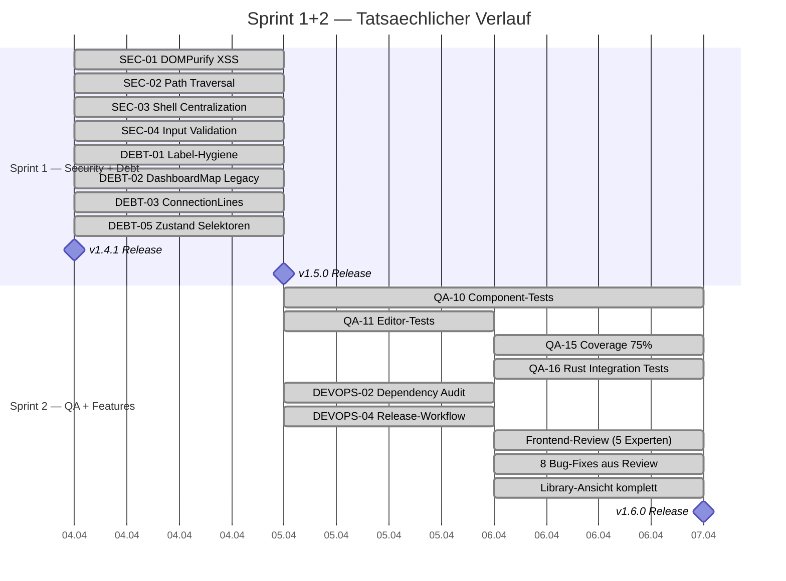
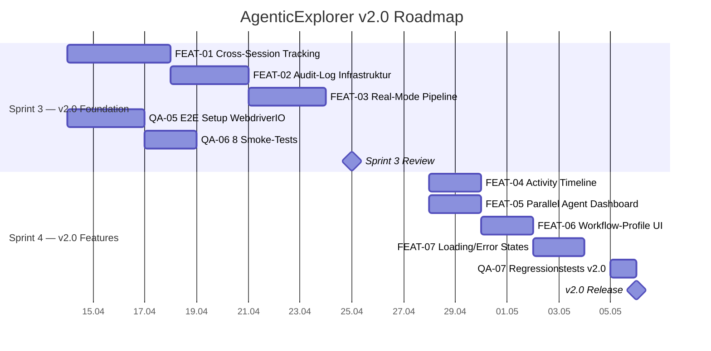
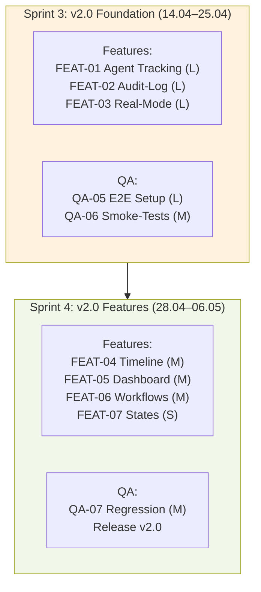
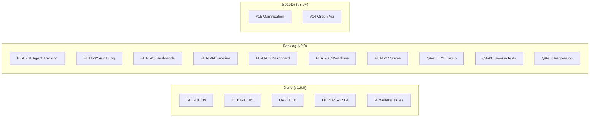

# Sprint-Plan: v1.5 → v1.6 → v2.0

> **Stand:** 2026-04-08 | **Basis:** v1.6.0 | **PO-Vorgabe:** Plan-First, GitHub Issues
> **Kapazitaet:** 1 Entwickler, ~6h/Tag effektiv

---

## 0. Abschluss-Report Sprint 1+2 (v1.5 / v1.6)

### Ergebnis

Sprint 1 und 2 sind **abgeschlossen und released** als v1.4.1, v1.5.0, v1.5.1 und v1.6.0.

### Metriken

| Metrik | Start (v1.4.0) | Ende (v1.6.0) | Delta |
|--------|---------------|--------------|-------|
| Frontend-Tests | 472 | 912 | +440 (+93%) |
| Rust-Tests | 60 | 111 | +51 (+85%) |
| Coverage | 24% | 83% | +59pp |
| Coverage-Schwellen | 24/32/58/24 | 75/75/65/75 | Enforced |
| Offene Issues | 24 | 4 | -20 |
| Releases | v1.4.0 | v1.6.0 | 5 Releases in 4 Tagen |
| Dead Code entfernt | — | 730+ LOC | DashboardMap, ConnectionLines |

### Zusaetzliche Arbeit (nicht im Original-Plan)

- Frontend-Review mit 5 Experten-Personas → 8 Bug-Fixes
- Library-Ansicht komplett neu (Skills, Agents, Hooks, Configs)
- Error-Grouping + Log-Virtualisierung
- UI-Polish: Umlaute, WCAG AA Light-Mode, CTA-Buttons
- Session-Status-Farben korrigiert
- Parallel-Implement Skill gebaut und eingesetzt

---

## 1. Sprint-Uebersicht v2.0 (Gantt)

---

## 2. Swimlane-Diagramm

---

## 3. Sprint-Details

### Sprint 3: v2.0 Foundation (14.04–25.04, 2 Wochen)

**Ziel:** Architekturelle Grundlagen fuer v2.0: Cross-Session Agent Tracking, Audit-Logs, Real-Mode Pipeline, E2E-Infrastruktur.

| ID | Task | Size | Beschreibung |
|---|---|---|---|
| FEAT-01 | Cross-Session Agent Tracking | L (20h) | GlobalAgentRegistry in Rust, session-uebergreifende Selektoren |
| FEAT-02 | Audit-Log Infrastruktur | L (15h) | Strukturierte Events nach AppData/audit.jsonl, Rotation |
| FEAT-03 | Real-Mode Pipeline | L (15h) | Mock durch echte Session-Daten ersetzen, Real/Mock Toggle |
| QA-05 | WebdriverIO + tauri-driver Setup | L (12h) | E2E-Testinfrastruktur aufsetzen |
| QA-06 | 8 Smoke-Tests | M (8h) | App-Start, Session, Terminal, Config, Theme, Favoriten, Navigation, Toast |

**Velocity:** ~70h | **Definition of Done:**
- GlobalAgentRegistry: Agents session-uebergreifend trackbar
- Audit-Log: Session-Start/Stop, Agent-Events persistent
- Real-Mode: Pipeline-View zeigt echte Daten
- E2E: `npm run test:e2e` mit 8 Smoke-Tests

**Abhaengigkeiten:**
- FEAT-03 braucht FEAT-01 (echte Agent-Daten)
- QA-06 braucht QA-05 (E2E-Setup zuerst)

---

### Sprint 4: v2.0 Features + Release (28.04–06.05, 1.5 Wochen)

**Ziel:** User-facing Features auf Foundation aufbauen, v2.0 releasen.

| ID | Task | Size | Beschreibung |
|---|---|---|---|
| FEAT-04 | Activity Timeline | M (8h) | Chronologische Ansicht aller Agent-Events |
| FEAT-05 | Parallel Agent Dashboard | M (10h) | Kanban-Board fuer Agent-Status (Pending/Running/Done/Error) |
| FEAT-06 | Workflow-Profile UI | M (10h) | Skills/Hooks erkennen, "Start Workflow" Button |
| FEAT-07 | Loading/Error/Empty States | S (6h) | Polish fuer 6 Komponenten |
| QA-07 | Regressionstests v2.0 | M (8h) | Bestehende + neue Tests, E2E-Suite erweitern |

**Velocity:** ~42h | **Release-Kriterien:**
- 912+ Tests, 75%+ Coverage
- E2E Smoke-Tests gruen
- Security-Review abgeschlossen
- v2.0 Roadmap-Features implementiert

---

## 4. Kanban-Board (Aktueller Stand)

---

## 5. Risiken

| Risiko | Impact | Mitigation |
|---|---|---|
| GlobalAgentRegistry Komplexitaet (Rust) | Sprint 3 Overrun | MVP: nur session-uebergreifende Map, kein Persistence |
| WebdriverIO + tauri-driver Kompatibilitaet | E2E blockiert | Fallback: Playwright mit HTTP-Bridge |
| Real-Mode Performance bei 50+ Agents | UI-Lag | Virtual Scrolling fuer Agent-Panel |
| Feature-Scope-Creep in Sprint 4 | Release verzoegert | Strict Scope: nur geplante FEAT-04..07 |
