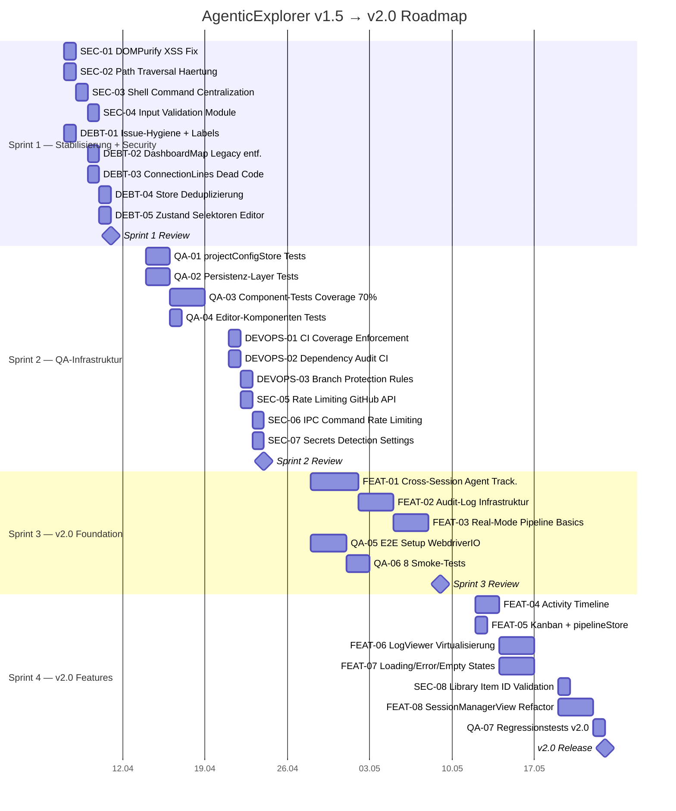
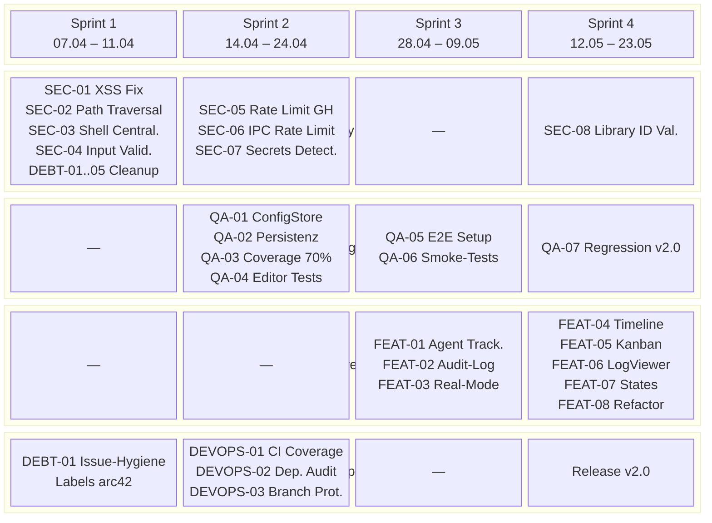

# Sprint-Plan: v1.5 (Stabilisierung) → v2.0 (Pipeline Fundament)

> **Stand:** 2026-04-04 | **Basis:** v1.4.0 | **PO-Vorgabe:** Plan-First, GitHub Issues
> **Kapazitaet:** 1 Entwickler, ~6h/Tag effektiv

---

## 1. Sprint-Uebersicht (Gantt)

---

## 2. Swimlane-Diagramm

---

## 3. Sprint-Details

### Sprint 1: Stabilisierung + Security (07.04 – 11.04, 1 Woche)

**Ziel:** Alle bekannten Sicherheitsluecken schliessen, technische Schulden abbauen, Issue-Hygiene herstellen. Ergebnis: saubere Basis fuer QA-Sprint.

| ID | Task | Size | Bezug |
|---|---|---|---|
| SEC-01 | DOMPurify XSS-Fix in MarkdownPreview.tsx | S (2h) | #68 follow-up |
| SEC-02 | Path Traversal Haertung file_reader.rs (non-existent paths) | S (3h) | Neu |
| SEC-03 | Shell Command Centralization (4 Module → 1 Utility) | M (4h) | Lessons 2026-03-29 |
| SEC-04 | Centralized Input Validation Module | M (4h) | Neu |
| DEBT-01 | Issue-Hygiene: Duplikat #61/#70 schliessen, Labels nach arc42 | S (2h) | #61, #70 |
| DEBT-02 | DashboardMap + pipelineAdapter Legacy-Code entfernen | S (3h) | #62 |
| DEBT-03 | ConnectionLines Dead Code entfernen | XS (0.5h) | Neu |
| DEBT-04 | agentStore vs pipelineStore deduplizieren | M (5h) | Neu |
| DEBT-05 | Zustand Selektoren fuer editorStore | S (3h) | #68 follow-up |

**Velocity:** ~26h | **Definition of Done:**
- `npx tsc --noEmit` + `npm run build` gruen
- `cargo check` gruen
- Kein `innerHTML` ohne Sanitization
- Alle Shell-Commands ueber zentrale Utility
- GitHub Issues mit Labels versehen

**Abhaengigkeiten:** Keine. Kann sofort starten.

---

### Sprint 2: QA-Infrastruktur (14.04 – 24.04, 1.5 Wochen)

**Ziel:** Test-Coverage auf 70% heben, CI-Pipeline haerten, Security-Hardening abschliessen. Ergebnis: Jeder Commit wird automatisch geprueft.

| ID | Task | Size | Bezug |
|---|---|---|---|
| QA-01 | projectConfigStore Tests (0% → 80%) | M (8h) | Neu |
| QA-02 | Persistenz-Layer Tests (tauriStorage + settings.rs) | M (8h) | #60 follow-up |
| QA-03 | Component-Tests schreiben bis Coverage 70% | L (15h) | #66 |
| QA-04 | Editor-Komponenten Tests (Toolbar, Preview, View) | M (4h) | #68 follow-up |
| DEVOPS-01 | CI Coverage Gate Enforcement (70% Schwelle) | S (3h) | #71 follow-up |
| DEVOPS-02 | Dependency Audit in CI (npm audit + cargo audit) | S (3h) | #57 follow-up |
| DEVOPS-03 | Branch Protection Rules (PR required, checks must pass) | S (2h) | Neu |
| SEC-05 | Rate Limiting fuer GitHub API Commands | M (4h) | Neu |
| SEC-06 | IPC Command Rate Limiting | M (4h) | Neu |
| SEC-07 | Secrets Detection in Settings | M (4h) | Neu |

**Velocity:** ~55h (1.5 Wochen) | **Definition of Done:**
- Coverage >= 70% Statements/Functions/Lines, >= 50% Branches
- CI blockiert PRs bei Coverage-Drop
- `npm audit` + `cargo audit` in CI
- Branch Protection aktiv auf `master`
- Rate Limiting mit Tests

**Abhaengigkeiten:**
- QA-03 haengt von Sprint 1 Cleanup ab (weniger tote Imports = weniger falsche Coverage-Luecken)
- DEVOPS-01 haengt von QA-03 ab (erst Coverage heben, dann Gate setzen)

---

### Sprint 3: v2.0 Foundation (28.04 – 09.05, 2 Wochen)

**Ziel:** Architekturelle Grundlagen fuer v2.0 legen: Cross-Session Agent Tracking, Audit-Log, Real-Mode Pipeline Basics, E2E-Test-Infrastruktur.

| ID | Task | Size | Bezug |
|---|---|---|---|
| FEAT-01 | Cross-Session Agent Tracking (GlobalAgentRegistry in Rust) | L (20h) | US-P4, Neu |
| FEAT-02 | Audit-Log Infrastruktur (Structured Events → Datei) | L (15h) | US-A4, Neu |
| FEAT-03 | Real-Mode Pipeline Basics (Mock → echte Session-Daten) | L (15h) | US-O2, #12 |
| QA-05 | WebdriverIO + tauri-driver E2E Setup | L (12h) | Neu |
| QA-06 | 8 Smoke-Tests (App-Start, Session, Terminal, Config-Tabs) | M (8h) | Neu |

**Velocity:** ~70h (2 Wochen) | **Definition of Done:**
- GlobalAgentRegistry: Agents ueber Sessions hinweg trackbar, Events emittiert
- Audit-Log: Mindestens Session-Start/Stop, Agent-Erkennung, Fehler geloggt
- Real-Mode: Pipeline-View zeigt echte Daten statt Mock
- E2E: `npm run test:e2e` laeuft mit mindestens 8 Smoke-Tests
- Alle bestehenden Tests weiterhin gruen

**Abhaengigkeiten:**
- FEAT-01 → braucht sauberen agentStore (Sprint 1 DEBT-04)
- FEAT-03 → braucht FEAT-01 (echte Agent-Daten)
- QA-06 → braucht QA-05 (E2E-Setup zuerst)

---

### Sprint 4: v2.0 Features + Release (12.05 – 23.05, 2 Wochen)

**Ziel:** User-facing Features auf Foundation aufbauen, UI polieren, v2.0 releasen.

| ID | Task | Size | Bezug |
|---|---|---|---|
| FEAT-04 | Activity Timeline Komponente | M (8h) | Neu |
| FEAT-05 | Kanban mit pipelineStore verbinden | S (3h) | #17 follow-up |
| FEAT-06 | LogViewer Virtualisierung (react-window) | L (12h) | Neu |
| FEAT-07 | Loading/Error/Empty States fuer 6 Komponenten | M (10h) | #65 follow-up |
| FEAT-08 | SessionManagerView zerlegen (Refactoring) | L (12h) | #62 |
| SEC-08 | Library Item ID Validation | M (4h) | Neu |
| QA-07 | Regressionstests v2.0 Features | M (6h) | Neu |

**Velocity:** ~55h (2 Wochen) | **Definition of Done:**
- Activity Timeline zeigt Agent-Events chronologisch
- Kanban-Board reflektiert echte Pipeline-Daten
- LogViewer scrollt fluessig bei 10.000+ Zeilen
- Alle 6 Komponenten haben Loading/Error/Empty Zustaende
- SessionManagerView < 300 Zeilen nach Refactoring
- Coverage bleibt >= 70%
- **v2.0 Release-Tag + Changelog**

**Abhaengigkeiten:**
- FEAT-04 → braucht FEAT-02 (Audit-Log als Datenquelle)
- FEAT-06 → unabhaengig, kann parallel
- QA-07 → nach allen Features

---

## 4. Kanban-Board (Initialer Zustand)

---

## 5. Risiken und Mitigationen

| Risiko | Impact | Mitigation |
|---|---|---|
| Coverage 70% nicht erreichbar in 1.5 Wochen | Sprint 2 verzoegert | Schwelle auf 60% senken, Rest in Sprint 3 nachholen |
| WebdriverIO + Tauri-Driver Kompatibilitaet | E2E-Setup blockiert | Fallback: Playwright mit HTTP-Bridge |
| GlobalAgentRegistry Komplexitaet (Rust) | Sprint 3 Overrun | MVP: nur Session-uebergreifende Map, kein Persistence |
| Store-Deduplizierung bricht bestehende Tests | Sprint 1 Instabilitaet | Erst Tests lesen, dann refactorn. Feature-Flag falls noetig |

---

## 6. Metriken pro Sprint

| Metrik | Sprint 1 | Sprint 2 | Sprint 3 | Sprint 4 |
|---|---|---|---|---|
| Test-Coverage | Baseline halten | >= 70% | >= 70% | >= 70% |
| Offene Security-Issues | 0 | 0 | 0 | 0 |
| Offene Bugs | <= 2 | <= 2 | <= 3 | 0 |
| E2E-Tests | — | — | >= 8 | >= 12 |
| Build-Zeit | Baseline | Baseline | < 90s | < 90s |

---

*Erstellt: 2026-04-04 | Naechste Review: Sprint 1 Retro (2026-04-11)*
